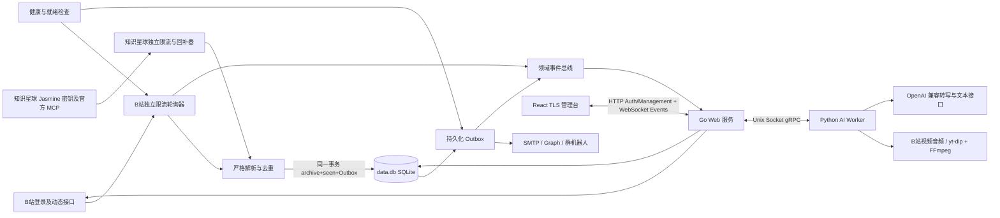

# Bili Notify 需求分析与技术设计

## 1. 背景与边界

Bili Notify 面向个人或小团队，在一个 Docker 容器中归档 B 站 UP 主和已授权账号可见的知识星球。B 站使用登录后的网页接口轮询，知识星球通过 Jasmine 密钥调用官方 MCP；“及时”是上游能力可用且未触发限流时的服务目标，不是无条件保证。

系统处理账号有权查看的 B 站动态和知识星球主题。B 站只持续同步每个 UP 最近 N 条可映射评论区坐标的内容；每个知识星球来源独立选择采集全部主题，或仅采集一个或多个稳定用户 ID 发布的主题。知识星球首次启用时按该范围全量回补主题、附件和评论，此后轮询新内容并周期性刷新全部已归档主题。作者过滤只决定新主题能否进入档案，不破坏已归档主题的完整评论树；未命中主题不保存、不下载附件且不通知，但仍推进扫描游标和水位。所有评论节点都归档，通知目标严格限定为当前 UP 或星球 `owner`，管理员、嘉宾、合伙人、普通作者和其他用户都不会触发评论通知。未知内容结构不猜测、不写 seen、也不推进水位。上游编辑更新当前快照，删除写 tombstone，恢复旧 ID 不视为新增。

主要目标：

- 最多 100 个 UP 时，动态发现延迟 P95 不超过 60 秒；健康渠道投递 P95 不超过 10 秒。
- 首次添加 UP 只建立当前页基线，不发送历史内容；新纳入评论跟踪的内容同样只 baseline 已有 UP 回复。基线内容仍会写入内容库，便于管理台回看。
- 每条新动态或新的 UP 回复广播给全部已启用渠道；容器重启不丢失待投递通知。
- 自动 AI 处理默认关闭；开启后，非基线、顶层 `DYNAMIC_TYPE_AV` 新动态必须按“转写 → 总结”的依赖顺序执行，转发中嵌套的视频不触发。
- UP 回复通知必须从根评论展开完整对话串；仅保证在「最近 N 条内容」与根/子评论翻页窗口内可发现。
- 部署前不生成或挂载任何主密钥、管理员密码哈希或 TLS 私钥。
- 管理台在桌面和手机上提供可访问、实时且明确区分在线与过期数据的运维视图；并支持对已采集动态/UP 回复的分页检索。

## 2. 系统结构

代码按功能划分为顶层包：`bilibili` 负责 B 站网页接口与二维码登录，`zsxq` 负责知识星球 MCP 客户端、严格解析、动态回补和评论同步，`media` 负责安全附件本地化，`state` 负责事务和持久化，`notify` 负责投递协议，`service` 负责编排 B 站、Outbox、OAuth 和领域事件，`web` 负责认证、`/api/v4`、WebSocket 与嵌入式管理台。知识星球客户端只向固定 MCP 原点显式发送 `X-Api-Key`，不持有 cookie jar；协议与安全边界详见 `docs/zsxq-session-api-design.md`。

AI 子系统采用“持久化控制面 + 可替换执行面”：Go 主进程把模型配置档、提示词模板、任务输入、进度和结果持久化到 `data.db`，提交任务时同时密封模型与提示词配置快照，避免排队期间的设置修改改变已有任务语义；调度器以一个转写槽位和两个总结槽位从队列领取任务，再通过仅本机 Unix Socket 暴露的内部 gRPC 调用 Python Worker。Python Worker 使用 yt-dlp 读取指定 BVID/分 P，下载连接以连续 60 秒无响应作为单次失败边界，对元数据、普通 HTTP 和分片请求分别最多重试 10 次并执行最长 30 秒的指数退避；随后由 FFmpeg 提取并切分为最长 10 分钟的单声道 16kHz、16-bit FLAC，显式限制采样位深，使单个切片在最坏情况下仍低于 OpenAI 兼容 multipart 的 25 MB 上限。Worker 通过 `/audio/transcriptions` 请求 `verbose_json` 和 segment timestamps，并把分段时间加上音频切片偏移。文本总结对超长输入执行分块 Map/Reduce。模型 Base URL、API Key、模型名、语言、超时、温度、上下文字符预算和提示词均由管理台配置，不绑定单一供应商；最大输出 Token 留空或为零时不向供应商发送 `max_tokens`，正整数没有应用侧业务上限。模型的可用状态是管理员标记而非执行权限，停用模型不会阻止工作台选择和任务提交；默认模型必须同时可用。管理台可以通过 Worker 对文本或转写模型发起一次最多 20 秒的最小真实推理来检测连通性，该操作可能产生极小的供应商费用，结果只在当前页面显示、不持久化，也不会自动启停模型。Worker 向标准输出写 JSON 结构化日志，覆盖进程生命周期、任务阶段、音频切片字节数和数量、上游 HTTP 状态/耗时/请求 ID 及经过截断和密钥脱敏的错误消息，但不记录 API Key、Cookie、音频、转写正文或提示词；日志级别由 `BILI_NOTIFY_AI_LOG_LEVEL` 控制。Worker 不可用时任务保持 queued，主进程的采集、通知和管理能力不受影响；正在运行的任务在主进程重启后标为 `worker_interrupted`，由管理员显式重试。

自动处理是一条显式运行设置，默认关闭；开启前必须存在“已启用且默认”的转写配置、“已启用且默认”的文本配置和默认总结提示词，开启期间破坏这三个不变量的设置修改会在同一数据库事务中回滚。采集事务只为非基线、顶层 `DYNAMIC_TYPE_AV` 且存在 BVID 的新动态创建两个幂等任务，总结任务依赖转写成功后才可领取；转写失败或取消会把总结标为 `skipped`，重试转写会同时恢复该总结。自动任务及结果同时显示在 AI 工作台和动态历史详情。每次自动转写和总结到达成功或失败终态时，分别为采集当时的启用渠道创建通知；转写失败不会再发送总结通知。邮件保持一封完整正文，机器人按各自限制把完整转写拆成可恢复的多段投递，Outbox 进度避免重试已成功段。

安全边界建立在最小暴露面上：内部 RPC 不监听 TCP，Socket 模式为 `0600`；模型 Key、B站 Cookie、AI 输入和结果使用现有 Vault 加密后写入 SQLite，列表接口不返回任务输入/结果，只有详情接口按需解密；连通性检测只向已认证管理员返回供应商错误对象中的消息，不返回完整响应正文，检测输入、供应商错误和 API Key 均不持久化或写日志。Worker 的任务目录为 `0700`，Cookie 临时文件为 `0600` 且下载完成即删除，成功任务删除音频缓存，失败缓存受 24 小时 TTL 和 5 GiB LRU 上限约束。供应商地址必须是无凭据、查询和 fragment 的绝对 HTTPS URL。取消通过 gRPC Context 传播，任务状态转换由 SQLite 条件更新约束，`client_request_id` 提供提交幂等性。

跨平台持久化以平台作为所有身份的一部分：账号写入 `platform_accounts`；来源 ID 为 `bilibili:up:{uid}` 或 `zsxq:planet:{group_id}`；知识星球来源还保存 `all | selected_authors` 模式及用户 ID/可选显示名称列表；内容 ID 为 `{platform}:content:{external_id}`；评论 ID 为 `{platform}:comment:{external_id}`。用户 ID 是匹配依据，名称只是管理员备注且不会从主题自动改写。`contents` 保存当前正文、类型、统计、首次发现、最后同步和删除 tombstone，`attachments` 保存远端元数据与本地相对路径，`comment_nodes` 使用邻接表保存 `root_id/parent_id`，查询时稳定重建 `children`。内容/评论归档、seen 与 Outbox 在同一事务中提交；编辑只更新当前快照，完整成功的评论分页才能把缺失节点标记为删除，恢复已有 ID 不生成新通知。一轮同步把同一内容的多个目标作者评论合并为一个 `comment_digest`，载荷只包含新触发节点及各自从已知根开始的祖先路径。

轮询器默认以 30 秒为目标周期、每个平台 2 请求/秒、4 个同时在途请求。B 站和知识星球分别拥有一个覆盖该平台全部 HTTP 路径的 RequestGate，统一执行速率、并发、请求超时和风控暂停；热更新 gate 时先停止接纳并等待旧请求排空，再安装新约束。服务默认每 10 分钟批量查询当前登录账号与监控 UP 的关注关系：已关注且完成空间同步的 UP 使用账号综合动态流，其余 UP 轮询空间动态；关系未知时明确走空间接口。已关注 UP 默认每 30 分钟额外执行一次空间完整性校验。空间和综合流默认最多翻 10 页；超过上限不会静默推进游标，综合流会退回空间同步后重新建立基线。采集从不读取渠道来决定是否运行：零启用渠道时仍归档、写 seen、推进基线和同步评论编辑/删除，只是不创建 Outbox。

评论监控按平台独立调度。B 站默认每 120 秒同步每个 UP 最近 N 条（默认 10）可映射评论区坐标的内容，并翻完全部根评论与每个根下的全部子回复；退出最近 N 窗口后保留树但不再请求。知识星球默认每 600 秒同步全部已归档主题：主题详情中的 `show_comments` 节点数与 `comments_count` 一致时，该快照可直接作为完整评论树；不一致时必须继续翻完独立评论接口，不能把展示子集误判为完整树。主题内文件只有元数据，下载前通过 `/v2/files/{file_id}/download_url` 取得临时地址；禁止下载或文件已删除时仍归档元数据，鉴权、限流和上游故障则让整轮重试。上一轮未结束时不启动重叠任务。两个平台首次同步评论均只建立基线。运行设置由 SQLite 持久化并热更新；环境变量只为空库播种，B 站和知识星球分别使用 `BILI_NOTIFY_BILIBILI_*` 与 `BILI_NOTIFY_ZSXQ_*`。

知识星球匿名提问不会返回提问者身份；归档时使用主题 ID 构造稳定的匿名作者 ID，不能因为缺少 `question.owner` 阻断整页同步。MCP 的 401 会清空失效密钥并要求管理员在 Jasmine 重建或更新；星球级 403 只标记来源错误，不回退 Cookie 或模拟客户端。

新内容按发布时间和稳定 ID 由旧到新处理。知识星球启用时先固定最新页高水位，再持久化分页回补水位以前的历史；增量轮询持续翻页直至旧高水位，确保指定作者不在首页时仍可发现。回补内容不通知，回补期间水位以后的新内容走实时通知。修改知识星球作者范围只影响之后扫描到的主题：不删除已有档案、不重置高水位或回补游标，也不补采已经越过的过滤内容；未完成回补从当前游标立即采用新范围。任务只有在平台 HTTP 状态和业务码均成功后才删除；网络错误、429 和 5xx 分级重试，不可恢复配置或鉴权错误进入阻塞。删除来源会通过索引删除所属 Outbox，并在同一数据库事务中级联删除内容、附件元数据、评论、seen 和同步状态，同时写入持久化媒体清理任务；后台 cleaner 幂等执行并持久化重试，进程重启不会丢失清理意图。删除后的知识星球来源不会因连接或更换密钥自动恢复，需要管理员手动重新添加。

## 3. B站与通知协议

B站适配器使用二维码生成、二维码轮询、导航验证、关注关系 `/x/relation/relations`、综合动态更新 `/x/polymer/web-dynamic/v1/feed/all/update`、综合动态 `/x/polymer/web-dynamic/v1/feed/all`、空间动态，以及评论根列表 `/x/v2/reply` 与子评论 `/x/v2/reply/reply`。动态请求显式携带登录 Cookie 与 `itemOpusStyle,listOnlyfans,onlyfansAssetsV2` 功能开关，以获取账号有权查看的充电动态。综合流只深度解析已关注的监控 UP；动态档案、seen、Outbox 与账号级 `update_baseline` 原子提交。登录成功后必须再次验证账号 UID 和名称才加密保存 Cookie；切换账号会重建关注关系和综合流基线，但保留内容档案与 per-UP 去重状态。不配置风控规避逻辑，不实现 WBI（若经典评论接口全面失效需另立项）。二维码状态由 Engine 每两秒推进并通过领域事件推送到管理台。

动态类型按实际内容归一化：B 站返回为 `DYNAMIC_TYPE_DRAW` 但图文卡片没有图片时记为 `DYNAMIC_TYPE_WORD`；有图片时仍为 `DRAW`。评论区坐标优先取动态 `basic.comment_type` 与 `basic.comment_id_str`，且始终以 B 站原始类型解释坐标；因此无图文字 opus 仍可能使用相簿评论区 11。缺失 `basic` 时仅对可确定映射的原始类型兜底（视频 avid、文字/转发动态 id、专栏 cvid）。图文动态在无 `basic` 时不得猜测 11/17，直接跳过跟踪。转发评论区挂在转发自身。PGC 与通用卡片不进入评论跟踪。

SMTP 只支持隐式 TLS 和 STARTTLS，并校验证书。Microsoft 使用 OAuth 2.0 设备码与委托 `Mail.Send`、`Mail.ReadWrite` 权限，访问令牌过期时自动刷新并持久化。钉钉与企业微信使用 HTTPS Webhook；飞书只使用应用机器人，要求 `app_id`、`app_secret` 和目标群 `chat_id`，应用必须启用机器人并加入目标群，至少开通“以应用的身份发消息”（`im:message:send_as_bot`）权限且在权限变更后发布新版本；图片和文件投递还需对应的上传权限。飞书 tenant token 缓存按 App ID 与 App Secret 的单向指纹隔离，凭据轮换必须立即重新鉴权，不能继续复用旧凭据取得的 token。权限扩大的升级会禁用 Microsoft 渠道并清除旧授权；飞书升级会删除废弃的 Webhook/签名秘密，并禁用缺少 `chat_id` 的渠道。飞书测试会把已知业务码映射成可执行的配置提示，例如 `10014` 表示应用凭据无效、`230002` 表示机器人尚未加入目标群；上游响应正文仍不得进入日志或 API 响应。

所有通知 HTTP 协议响应最多读取 1 MiB；成功响应超过上限、JSON 损坏、业务码缺失或类型漂移都视为永久协议错误，避免把无法证明成功的响应误判为已投递。网络故障、HTTP 429 和 5xx 可重试，`Retry-After`（秒数或 HTTP 日期）是重试调度的最小等待时间；4xx、OAuth 凭据失效和明确业务错误进入阻塞。错误只保留操作名、HTTP 状态和业务码，不拼接响应正文、请求 URL、OAuth 描述或飞书 `msg`，避免 Webhook 查询签名、令牌及上游回显秘密进入日志。

附件统一落在 `data_dir/media/{platform}/{source_id}/{content_id}/`。B 站继续只下载可安全识别的图片并维持 10 MiB 单图保护；知识星球支持图片、文件、音频和视频，默认单件上限 500 MiB、平台总预算 50 GiB。超过单件限制或总预算时只保留元数据，不删除旧档案，也不阻断正文、评论和通知。所有下载只接受 HTTP(S) 公网目标，每次重定向重新校验；路径段由 `pathologize` 生成，临时文件为 `0600`，最终提交由 `fileflow` 执行冲突安全移动并持久化其实际返回路径，路径穿越和符号链接均拒绝。知识星球文件先经 MCP 获取签名 URL，附件首跳和所有重定向都不携带 `X-Api-Key`、Authorization 或 Cookie；签名下载 URL 和本地绝对路径不出现在日志、通知或列表响应。认证附件端点支持 Range，并设置 attachment disposition 与 `nosniff`。清理器不递归删除不可信目录，只删除任务指定文件并向上修剪 `media/` 内的空目录；越界或符号链接路径进入阻塞状态。

动态通知保存接口返回的完整正文，并按类型提取标题、简介、内容直达链接、富文本链接、封面或多图、视频时长与播放信息、互动统计和转发原文；动态正文本身不为补充内容发起额外的 B 站请求。升级后每个已有 UP 首次可见的充电动态只归档并建立 seen 基线，不投递；同批普通新动态照常投递，后续新充电动态正常投递。评论通知在发现 UP 回复后按 root 展开对话串。邮件与 Microsoft Graph 在存在本地文件时以内联 CID/附件嵌入图片，否则退回远程 ``；钉钉自定义机器人继续使用可展示外链图片的 Markdown（``，不用本地文件）；飞书应用机器人上传本地图片并在富文本中嵌入；企业微信先发正文 Markdown，再按序追加 `msgtype=image`（原始字节 ≤2 MiB）。机器人消息在各平台限制内按 UTF-8 边界截断，始终保留截断提示和原内容链接。

知识星球新内容进入 Outbox 时，会把全部非图片附件（`file`、`audio`、`video`）的稳定 ID、原始名称、MIME、声明大小、本地相对路径和本地化错误复制进不可变载荷；已有附件链接仍保留。因此内容编辑、附件表变化和签名下载地址失效都不会改变已排队通知。空名称按顺序生成“附件-N”，并尽量从 MIME 或归档路径保留扩展名。投递时通过受约束的流式打开接口再次验证文件位于 `data_dir/media`、路径不含符号链接且目标是普通文件，以实际大小作为渠道判断依据。

正文总是在普通文件之前确认发送。SMTP 把普通文件作为 MIME attachment 流式发送且不设置应用侧大小上限；Microsoft 先建立草稿，小于 3 MiB 的文件直接添加，3–150 MiB 使用 320 KiB 整数倍的分片上传会话，最后发送草稿；飞书逐个上传并发送 `msg_type=file`，单文件上限 30 MiB；企业微信从机器人 Webhook 安全提取 key，上传临时素材再发送 `msgtype=file`，合法范围是 5 B–20 MiB；钉钉不上传普通文件，继续展示附件名称和原内容链接。未本地化、已丢失、空文件或渠道超限的文件不会阻断其余内容，正文会明确列出文件名、实际/声明大小和跳过原因。

Outbox `progress` 分别记录正文段、图片数、普通文件数和 Microsoft 草稿 ID。飞书、企业微信和 Microsoft 在重试时从首个未确认文件继续，避免重复发送已确认的部分；鉴权、配置与确定性业务协议错误进入 blocked，网络、429 和 5xx 沿用退避重试。带本地媒体的单次投递和 SMTP 操作允许最长 15 分钟；HTTP 仍限制连接、TLS 握手和响应头时间，但不使用会截断流式请求体的全局 10 秒期限。升级前已经排队的载荷不反向补造附件快照。

## 4. 管理接口与实时协议

管理服务默认监听 `:8443`，只接受 TLS 1.3。静态 React 页面、认证接口和 WebSocket 同源部署。

HTTP 承担认证生命周期和全部管理资源 API：

| 方法与路径 | 用途 |
| --- | --- |
| `GET /api/v4/session` | 查询初始化和会话状态 |
| `POST /api/v4/setup` | 使用日志初始化码设置首个管理员密码 |
| `POST /api/v4/session` | 登录 |
| `DELETE /api/v4/session` | 注销 |
| `PUT /api/v4/session/password` | 验证当前密码并修改密码 |
| `GET /api/v4/runtime`、`GET /api/v4/settings` | 分别读取运行状态/时区和完整运行设置 |
| `GET /api/v4/accounts` | 读取 B 站与知识星球账号的非秘密状态 |
| `GET/POST /api/v4/accounts/bilibili/qr`、`DELETE /api/v4/accounts/bilibili/qr/{id}`、`DELETE /api/v4/accounts/bilibili/session` | 查询、建立或取消二维码事务，以及清除 B 站会话 |
| `PUT/DELETE /api/v4/accounts/zsxq/credential`、`GET /api/v4/accounts/zsxq/groups` | 验证、更新或删除知识星球 Jasmine 密钥，以及实时读取账号可见星球 |
| `GET /api/v4/sources`、`POST /api/v4/sources/bilibili`、`POST /api/v4/sources/zsxq`、`PUT/DELETE /api/v4/sources/{id}` | 查询采集源；分别添加 B 站 UP 或从登录账号星球中添加知识星球；启停或删除来源 |
| `GET /api/v4/contents[/{id}]` | 按平台、来源、关键字、时间和稳定游标查询统一内容 |
| `GET /api/v4/contents/{id}/comments` | 返回稳定重建的嵌套评论树 |
| `GET /api/v4/contents/{id}/attachments/{attachment_id}` | 认证下载本地附件，支持 Range |
| `GET/POST /api/v4/channels`、`PUT/DELETE /api/v4/channels/{id}` | 读取、创建、更新或删除通知渠道 |
| `POST /api/v4/channels/{id}/test` | 发送渠道测试通知 |
| `GET /api/v4/deliveries` | 按稳定游标读取投递任务 |
| `POST /api/v4/deliveries/{id}/retry` | 将单个阻塞投递任务立即重新入队，返回 202，不同步等待发送 |
| `GET /api/v4/microsoft-logins`、`POST/DELETE /api/v4/channels/{id}/microsoft-login` | 读取、启动或取消 Microsoft 授权 |
| `PUT /api/v4/settings` | 严格校验并完整更新跨平台运行设置 |
| `GET /api/v4/audit-logs` | 按操作、结果、资源、时间和关键字分页查询管理员操作日志 |
| `GET /api/v4/ws` | 校验会话并升级 WebSocket |

HTTP 负责全部浏览器主动请求：资源写操作使用单个、合法 UTF-8 的 JSON body，硬上限为 1 MiB，写请求必须携带会话中的 CSRF Token；`PUT /api/v4/settings` 必须提交全部字段，缺失和未知字段均拒绝。成功响应直接返回资源，不增加通用 `data` 外壳；错误统一返回 `{error:{code,message}}`。`api/openapi.yaml` 是 v4 请求、响应、错误和实时消息的唯一传输契约；不注册 `/api/v2` 或 `/api/v3`。

内容、投递和审计列表统一返回 `{items,page:{next_cursor,has_more}}`，下一次请求只把非空 `next_cursor` 原样作为 `after` 传回。游标是服务端不透明值；投递按不可变的 `(created_at DESC,id DESC)`，内容按 `(published_at DESC,id DESC)`，审计按 `(occurred_at DESC,id DESC)` 稳定排序。内容与投递默认每页 20 条，审计默认 50 条，均最多 100 条且不接受 offset；历史时间范围为半开区间 `[from,to)`。内容详情同时返回不含私有远端 URL 的附件元数据，附件字节只能从认证下载端点取得；评论详情直接返回完整嵌套 `children`，不再暴露旧线性 thread 投影。

WebSocket 只承载失效信号，不接受业务命令或资源数据。连接后先发送 `{event:"sync.required",revision,topics}`，客户端按需通过 REST 建立基线；后续将同一事件总线批次合并为 `{event:"resources.invalidated",revision,topics}`。资源主题只有 `accounts`、`sources`、`contents`、`backfills`、运行设置、渠道、投递、Microsoft 登录、审计和 AI；旧的 `ups`、`dynamics`、`comments` 与 `bilibili-login` 主题不再对外。客户端丢失连接或遇到未知消息后保留最后成功数据，通过资源 GET 重建事实，不在浏览器合成服务端领域状态。

领域事件主要由实际状态写入驱动：空闲投递周期不发布事件，空闲采集不广播整份 UP 列表；关注关系刷新、采集路由改变、就绪状态或风控暂停等时间派生状态跨越边界时发布对应轻量事件。投递成功、失败、重试或阻塞只标记状态和投递主题；渠道授权信息只有在实际变化时才标记渠道主题。事件总线使用主题脏标记合并突发更新，业务路径不等待浏览器。每个连接只有一个串行写入器；慢客户端会被关闭并通过重连恢复。WebSocket 消息限制为 1 MiB，并以独立的 30 秒 Ping 保活。

管理员会话 Cookie 为 Secure、HttpOnly、SameSite=Strict，空闲 8 小时或创建 24 小时后失效。登录和初始化只按 TCP 对端来源地址（不信任客户端可伪造的代理转发头）与全局失败次数限流，窗口一分钟后恢复。WebSocket 必须通过会话 Cookie 和同源 Origin 校验；密码修改会先清空所有旧会话并关闭全部连接，再为当前请求创建替代会话，响应返回该会话的新 CSRF token。

所有管理 API 响应携带服务端生成的 `X-Request-ID`。认证和状态变更请求（含失败、未认证和 CSRF 拒绝）同步追加到 SQLite `audit_logs`，记录管理员/匿名来源、独立会话标识、远端地址、路由、目标、结果、耗时和白名单变更摘要；不记录普通读取、静态资源和 WebSocket 消息。操作日志默认保留 180 天，由管理台分页查询。审计写入失败不会篡改已经完成的业务结果，但会输出系统错误并增加指标。

渠道读模型只返回非秘密设置与 `configured_secrets`，不返回掩码占位值。渠道更新中省略秘密表示保留，显式提供表示替换；OAuth 令牌不接受浏览器写入。

## 5. 首次初始化与秘密保护

服务使用单一 `data_dir`，默认 `/data`。首次启动自动创建：

- `data.db`，SQLite（goose 版本化 schema），文件模式 `0600`；
- `master.key`，32 字节随机 AES-256 主密钥，模式 `0600`；
- `tls.pem`，ECDSA P-256 自签名证书和私钥，模式 `0600`；
- `media/`，动态图片/封面落盘目录，目录模式 `0700`，文件 `0600`（按需创建）。

目录模式为 `0700`。已有数据库缺少主密钥、密钥长度错误、TLS 文件损坏或迁移失败时拒绝启动，不自动覆盖或删除。v10 会在单个事务中把 v0.4.5 的两代事实表转换为唯一的 `sources/contents/comment_nodes/seen_items/outbox` 模型并删除旧表；任何旧密文或载荷损坏都会整体回滚，schema 版本保持不变。该迁移不可逆且程序不自动备份：运维必须先停止进程，再一起备份 `data.db`、存在时的 `data.db-wal`、`data.db-shm` 与 `master.key`。若目录中仍存在旧版 `state.db` / `content.db`，拒绝启动且不自动导入；运维需备份后换用全新数据目录。主密钥与数据库同卷以无人值守重启为优先，因此不承诺防护整个数据卷同时失窃。

未初始化数据库启动时生成 12 位 Crockford Base32 初始化码，只写入结构化日志并保存在进程内存。首次设置管理员密码使用原子事务，成功后代码立即清除；未初始化实例重启会生成新码。管理员密码使用 Argon2id，哈希保存在数据库元数据中。

知识星球 API 密钥、B站 Cookie、SMTP 密码、OAuth 令牌、Webhook 与机器人签名密钥使用 AES-256-GCM 加密，每条记录使用独立 nonce，并把 **表名与主键** 作为附加认证数据。浏览器和日志不输出任何秘密。

本版本不迁移旧 bbolt/双库卷；旧卷由操作者显式备份和移除，程序不会执行破坏性升级。

## 6. 管理台设计

前端使用 React 19、React Compiler、TypeScript、Vite、React Router Data Mode、TanStack Query、React Aria、CSS Modules/CSS Variables 和从 OpenAPI 生成的传输类型，构建产物通过 Go `embed` 打入单一二进制。服务端是会话、运行状态、设置、UP、渠道、投递和历史数据的唯一权威；TanStack Query 是浏览器唯一远程状态缓存，页面不复制全局 dashboard，也不推导 `ready` 或服务端更新时间等领域事实。Router 负责 URL、路由懒加载和错误边界，筛选与游标进入 URL；表单草稿、Dialog、展开项和灯箱只保存在最近组件。代码依赖方向固定为 `app → pages → modules → shared`，跨模块只经过公共入口，完整约束见 `docs/frontend-architecture.md`。

页面采用实时运维工作台而不是等权卡片墙：概览首先显示整体就绪状态和阻塞原因，再显示当前 B站账号 UID/名称、UP、渠道与队列证据，最后提供操作；UP 列表显示关注状态、检查时间和当前综合流/空间采集路由。设置页将运行参数按基础采集、高级采集、投递与告警、日志分组，一次提交完整设置；外观主题和管理员密码保持独立。历史页按需查询 `data.db` 中的内容档案，支持动态/UP 回复 Tab、UP 过滤、时间范围、关键字与游标分页。动态历史使用接近 B 站网页动态流的直接阅读布局：正文可原生选择复制，图文采用单图或九宫格，视频等内容采用封面信息卡，转发内容嵌套展示，底部显示已有互动统计和独立的原内容外链；动态条目本身不打开详情弹窗。

后端没有指标历史时间序列，因此界面不制造无依据图表。数据使用 KPI、状态标签、卡片和明细列表；成功、警告、失败状态同时使用颜色、图标和文字。主题支持跟随系统、浅色和深色，偏好只存 localStorage；路由和筛选进入 URL，秘密和会话不进入浏览器持久化存储。

桌面使用侧栏，360–430px 手机使用底部导航、卡片列表和全屏编辑对话框。页面只读取自身依赖的资源 query；再次点击当前页面时使活跃资源失效并保留 URL 筛选条件，历史页按当前筛选重新查询内容列表。动态图片点击进入灯箱，组图支持按钮及键盘左右切换、Esc 或遮罩关闭，首尾不循环，灯箱始终使用未加缩略参数的原始媒体地址。投递队列只为阻塞任务提供逐条“立即重试”，提交后由后台异步发送。主要触控区域至少 44px，键盘焦点、屏幕阅读器标签和减少动画偏好必须可用。实时连接中断时保留最后成功数据、显示更新时间和过期警告，并按 1–30 秒指数退避重连。

时间统一使用进程本地时区（`time.Local` / 环境变量 `TZ`，镜像内嵌 `tzdata`）：通知文案中的发布时间、管理台展示、结构化日志时间字段均按本地墙钟输出；相对时刻比较仍基于绝对时间点，不依赖时区。Compose 默认 `TZ=Asia/Shanghai`。

## 7. 可观测性、运行与验证

Makefile 是本地与 CI 的统一任务入口：`make check` 执行生产二进制构建以及全部前端与 Go 检查，`make ci-check` 只执行由 CI 测试 job 负责的检查、把生产构建交给后续镜像 job，`make -jN check` 按依赖图并行执行互不冲突的检查，`make build` 生成本地二进制，`make docker-build` 和 `make worker-docker-build` 分别生成主服务与 AI Worker 生产镜像，两个 `*-docker-smoke-image` 目标验证已有镜像，细分目标通过 `make help` 查看。CI 根据 runner 类型分别限制 Make、Go、Vitest 和 Playwright 的并发数，避免嵌套 worker 过度争抢 CPU 与内存。

常规 CI 只在目标为 main 的 PR 和手动调用时运行。main 的 strict required check 要求合并候选基于最新 main 通过 `CI Gate`，因此合并后不再对等价代码重复执行常规 CI；CodeQL 仍在 main push 后运行，用于更新默认分支的安全扫描状态。PR CI 构建并冒烟验证 `linux/amd64` 主服务与 AI Worker 生产镜像：主服务验证 nonroot/只读运行、初始化、健康检查、优雅停止和持久化重启，Worker 通过共享 Unix Socket 调用真实 `GetCapabilities`，确认 nonroot/只读容器以及 yt-dlp、FFmpeg、gRPC 服务均可用；`CI Gate` 聚合所有结果并作为 main 的唯一 required check。现有 self-hosted 优先、macOS 次选、GitHub-hosted fallback 的 runner 选择策略保持不变。PR 不登录仓库、不发布镜像。独立 Release workflow 只接受 main 历史上的 `vMAJOR.MINOR.PATCH`，重新执行代码、观测配置与两个最终镜像门禁，经 `dockerhub-production` Environment 批准后登录 Docker Hub，把已经测试的同一对本地镜像分别添加相同的 SemVer 与 `latest` 标签并逐一推送；发布前同时检查两个完整版本标签都不存在，每个仓库的所有标签必须解析到同一 digest，两个 digest 分别附带 SPDX SBOM、keyless Cosign 签名和 GitHub build provenance。PR CI 的 BuildKit GHA layer cache 使用独立 scope 和 `mode=min` 加速重复构建；Release 不读取或写入 GitHub cache，而是从源码和锁定依赖完整构建发布镜像，避免共享缓存成为发布输入。

私有观测服务默认监听 `:9090`：`/healthz` 表示进程存活，`/readyz` 要求有效 B站会话、启用的 UP 和渠道以及近期成功采集。应用与 AI Worker 都通过 OTLP 导出 logs、metrics 和 traces，不再提供应用内 `/metrics`。Metrics 覆盖工作流、B 站请求、内容发现、投递、Outbox、媒体、认证/就绪/风控、UP/渠道/评论目标、关键配置阈值和审计失败，以及 Worker 的任务结果/耗时、供应商请求/耗时、音频字节和缓存体积；不使用 UID、任务 ID、渠道 ID、错误文本或正文作为 metric 属性。

运行日志使用 `log/slog` 输出统一 JSON stdout，并通过 OTel log bridge 导出；字段包含 schema、服务版本、进程 `run_id`、`category=system|audit`、组件、稳定事件名、结果和耗时。日志级别立即热更新，审计日志保留期由应用管理，系统日志保留期由 Loki 管理。密码、Cookie、Webhook、令牌及 URL 查询中的秘密均脱敏；`setup_code` 仅输出 stdout，OTLP 记录中脱敏。

可选观测栈由 OpenTelemetry Collector、Prometheus、Loki、Tempo 和 Grafana 组成。Collector 启用 memory limiter、batch、出口重试和 file-storage 持久化队列，logs 写 Loki，metrics 以 OpenMetrics 在 `:9464` 导出，traces 写 Tempo。Prometheus 还抓取 Collector、Loki、Tempo、Prometheus 和 Grafana 自身指标。Loki/Prometheus 保留 30 天，Tempo 保留 7 天；Grafana 预置数据源关联、运行总览、日志/trace 面板和 Prometheus 告警。基础部署为两个进程显式禁用 SDK，完整栈使用 `BILI_NOTIFY_OTEL_*` 配置启用。Worker 采用 OTLP HTTP/protobuf 和独立的 `service.name=bili-notify-ai-worker`，其 JSON stdout 与 OTLP log record 都带当前 trace/span 关联；供应商 HTTP 调用由自动 instrumentation 建 span，业务指标补充任务、供应商和缓存语义。

Trace 用于关联管理 HTTP、采集/评论/关系/认证/投递/审计工作流、B 站逻辑外部操作和 GORM/SQLite。Outbox 创建任务时把当前采集 span 的 W3C `traceparent` 写入任务载荷，异步投递恢复它作为 `delivery.send` 的父上下文，使采集、SQLite 入队、投递和通知渠道调用出现在同一条 trace；同一内容的多渠道投递形成并列分支，重试继续使用最初的采集上下文。系统通知等没有有效来源上下文的任务归入当次投递调度 trace，非法上下文只降级、不影响投递。空闲投递轮询及其 SQLite 查询不产生 root span。对这个低流量服务使用 parent-based always-sample，不记录探针、静态资源和 WebSocket 长连接，只记录握手；外部请求 span 不记录完整 URL/查询，GORM span 不记录查询变量。运行时导出失败不停止业务，非法 SDK/协议配置在启动时拒绝。异步父 span 可以先于投递子 span 结束，因此重试会拉长整条 trace；若跨度超过 Tempo 保留期，只能看到保留窗口内的部分。自动 AI 任务在采集事务中保存当前 W3C `traceparent/tracestate`，调度时恢复为 `ai.job.execute` 的父上下文，Go gRPC client 将上下文注入 Worker，使 Worker gRPC server span 与供应商 HTTP span 和动态采集属于同一 trace；总结任务继承转写执行 span，终态 AI 通知再继承当前 AI span。工作台任务则从创建任务的管理 API server span 开始，浏览器本身不接入 OTel。

生产镜像使用 Node 24 构建前端、与 `go.mod` 同步的 Go 工具链静态构建后端，最终 scratch 镜像以 UID 65532 运行，只挂载独立 `/data` 卷并保持只读根文件系统。Renovate 必须把新的 Go 指令版本和可用的 Alpine 构建镜像放入同一个升级 PR，并维护固定完整 SHA 的 GitHub Actions、固定 npm 范围与 lockfile，以及 Compose/Makefile 中的观测组件；开发依赖、Actions 和观测栈分别分组，任何依赖 PR 都必须通过现有 CI 且不自动合并。

自动测试覆盖：

- 真实应用装配的首次设置播种、健康接口、取消后的优雅退出和同数据目录重启，并对旧数据库、损坏 TLS、无法解密的持久化秘密和非法遥测协议执行启动失败测试；审计保留以可单次执行的批处理验证精确时间边界、超过 1000 条时的分批删除、数据库失败和取消；
- 空间动态与综合流的多页正常路径、seen 前沿停止、空或重复 offset、接口计数不足以及页数上限；任何不完整动态分页都不得提交部分历史、seen 或 Outbox，综合流溢出会清空 feed 游标并要求空间流重新同步；评论根页或子回复达到扫描上限时，已发现通知必须标记 `incomplete`；
- 投递调度通过受控阻塞渠道验证初始及热更新后的并发上限，通过五段退避及饱和边界验证重试，并保留不依赖绝对耗时门限的消息构造 benchmark；
- 各动态类型的富内容解析、评论区坐标映射、UP 回复发现与根串展开、基线、去重、Outbox、渠道渲染、篇幅边界、重试与通知协议；
- 本地真实 SMTP 会话同时覆盖隐式 TLS、STARTTLS、证书验证、AUTH PLAIN、多收件人、multipart/alternative 与内联 CID，并注入认证、RCPT、DATA 断流和取消故障；Microsoft OAuth/Graph 与群机器人使用本地确定性 HTTP 合同覆盖刷新持久化、401/429/5xx、`Retry-After`、截断/超大/畸形响应、业务码 schema drift、取消和错误脱敏，飞书 token 缓存验证应用隔离、过期刷新与并发单飞；
- 自动主密钥/TLS 生成、权限、损坏文件和旧 schema 拒绝；
- Argon2id、一次性初始化、会话、限流、密码变更与连接失效；
- 真实认证与 CSRF HTTP 管理 API（含 B站/Microsoft 登录和渠道测试的成功、取消、重复、上游失败与超时）、WebSocket 全主题与 revision、空闲周期不推送、会话过期、恶意 Origin、注销/密码变更连接失效、断开客户端隔离、重连全资源同步要求和秘密读模型；
- JSON 体积与 UTF-8 边界、安全响应头、登录限流窗口/来源隔离/伪造代理头、TLS 最低版本与私钥权限，以及媒体路径逃逸、父目录/文件符号链接、重定向、SSRF、非图片、取消和失败临时文件清理；
- 操作日志追加、筛选、保留清理、拒绝/失败路径、请求 ID和秘密值回归；
- React 单元、Query 集成和组件测试覆盖 API 运行时校验、WebSocket 失效通知与 REST 降级、会话 401 清理、mutation 后失效、异步请求竞态、结构化表单字段连线、桌面/移动端以及明暗主题；statements、branches、functions、lines 四项全局覆盖率均以 80% 为门禁，避免辅助函数掩盖关键页面回退；
- Chromium 确定性端到端链路把采集投递、管理安全和响应式验证拆为测试级隔离场景，每个场景使用独立临时目录、SQLite 和随机端口，共享一次预编译的 Go harness，并同时运行桌面浅色与 Pixel 7 触控深色项目：覆盖管理员初始化、二维码登录、关注关系与空间基线、综合流采集、历史归档、失败 Outbox、同目录重启、人工重试、无刷新 WebSocket 重连、资源编辑、设置持久化、操作日志安全摘要、秘密不回显，以及密码变更后当前设备获得替代会话、其他旧会话失效；旧 WebSocket 关闭时发起的会话探测不得在替代完成后用过期匿名响应覆盖新会话；浏览器与 harness 固定使用 `Asia/Shanghai`，前端自托管带 Unicode range 的 Noto Sans SC 可变字体，从而使日期、中文排版和页面高度不依赖 runner 环境；视觉比较只容许每张全页截图最多 256 个抗锯齿差异像素，尺寸变化、布局偏移和内容回退仍会失败；使用 axe 扫描登录、概览、操作日志和移动历史页面，并提交移动历史视觉基线；测试只连接本地 TLS 伪上游；
- `api/openapi.yaml` 是 REST DTO、错误和 WebSocket envelope 的传输契约源；TypeScript 类型由固定版本工具生成并接受 clean-tree 漂移检查，Go 侧以真实 HTTP 处理器和生产 WebSocket 序列化类型校验，Vitest 再通过与规范同形的 Zod 运行时边界拒绝非法响应；
- 生产 scratch 镜像的 nonroot/只读运行、健康检查、HTTPS 初始化、优雅停止和同卷重启。
- `telemetry.New` 通过本地 OTLP/HTTP protobuf 与 OTLP/gRPC 收集端真实导出 traces、metrics、logs，校验三类带前缀路径、资源属性、span/metric/log 字段和 Shutdown flush；不可达收集端验证记录路径不等待网络，导出失败仅在有界 Shutdown 返回。Prometheus 告警规则使用 `promtool test rules` 验证触发语义，Compose、Collector、Prometheus、Loki 与 Tempo 配置由独立 CI job 验证，不把 Docker 依赖加入普通单元测试。

提交前执行非修改型 gofmt、`go mod tidy -diff`、`go mod verify`、actionlint、npm high-severity audit、OpenAPI 生成漂移、前端 typecheck/typed lint/覆盖率/生产构建/gzip 预算/端到端检查，以及 `go build ./...`、`go test ./...`、`go test -race -shuffle=on ./...` 和 `go vet ./...`；完整本地门禁可通过 `make check` 运行，多核机器可使用 `make -jN check`。`web/dist` 是不纳入 Git 的构建产物；Make 在一次完整检查中只从 lockfile 安装并构建一次前端，所有会编译 `web` 包的 Go 目标和 Playwright 均依赖该产物。Vitest 使用 V8 统计除入口、纯类型和测试辅助代码之外的前端生产代码，statements、branches、functions、lines 任一低于 80% 时 CI 失败。Playwright 使用锁定版本的 Chromium 分别模拟桌面浅色和触控手机深色；axe 严重违规或已提交视觉基线变化均使检查失败。Go 覆盖率门禁只统计 `bilibili`、`notify`、`service`、`state`、`web` 五个核心包；CI 以 `go test -race -shuffle=on -covermode=atomic -coverpkg="$(go list ./bilibili ./notify ./service ./state ./web | paste -sd, -)" -coverprofile=coverage.out ./...` 一次运行仓库全部测试并同时完成 race 与覆盖率验证，总覆盖率低于 80% 时失败。独立的每日/手动 Stability workflow 为每轮启动新的测试进程，在 race detector 下默认以 10 个随机顺序运行全部测试；重复次数限制为 1–50，由 `GO_STABILITY_COUNT` 覆盖，重型门禁不加入普通本地 `make check`。固定版本的 govulncheck 作为 Go tool dependency 管理。Go 覆盖率 artifact 由不执行仓库代码的独立 job 通过 GitHub OIDC 上传 Codecov，不配置静态 Token，项目与 patch 目标均固定为 80%。`make test-protocol` 在 race detector 下重复通知与遥测协议测试三次，`make benchmark` 提供通知序列化、投递消息和禁用遥测记录的无绝对耗时阈值 benchmark。CI 必须在 Go 检查前构建前端，对观测配置与告警规则运行独立门禁，并对最终 Docker 镜像运行冒烟测试；CodeQL 每周及在 PR/main 上分析 Go 与 TypeScript。Docker 构建必须从 lockfile 重建前端并生成完整单二进制镜像；基础及完整 Compose 中应用保持镜像 UID 65532、只读根文件系统、无额外 capability，并使用命名卷实现重启持久化。
