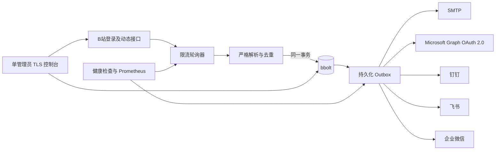

# Bili Notify 需求分析与技术设计

## 1. 背景与边界

Bili Notify 面向个人或小团队，在一个 Docker 容器中监控最多 100 个公开 B 站 UP 主。B 站没有面向任意 UP 主动态的官方推送能力，因此服务使用登录后的网页接口轮询；“及时”是接口可用和未触发风控时的服务目标，不是无条件保证。

首版只处理新发布的公开动态，包括文字、图片、视频投稿、专栏、转发、PGC 和通用内容卡片。直播状态、动态编辑、置顶变化、删除、关键词过滤、摘要合并、多租户、多实例高可用和历史回补均不在范围内。未知动态结构不会被猜测解析或标记为已处理，而是暴露错误等待程序更新。

主要目标：

- 最多 100 个 UP 时，动态发现延迟 P95 不超过 60 秒；发现后健康渠道投递 P95 不超过 10 秒。
- 首次添加 UP 只建立当前页基线，不发送历史内容。
- 每条新动态广播给全部已启用渠道。
- 容器重启不丢失已发现但尚未成功发送的通知。
- 不保存图片或视频，只发送 500 字以内摘要和原文链接。
- 不实现验证码、代理池、备用接口或其他风控规避逻辑。

## 2. 系统结构

代码按功能划分为顶层包：`bilibili` 负责网页接口与二维码登录，`state` 负责事务和持久化，`notify` 负责五种投递协议，`service` 负责编排轮询、OAuth 授权与 Outbox，`web` 负责管理控制台和观测接口，`cmd` 只处理命令与启动配置。

轮询器以 30 秒为目标周期，全局限制为 2 请求/秒、4 个并发请求。100 个 UP 的完整扫描约需 50 秒。每个 UP 最多继续翻 10 页直至遇到持久化的动态 ID；超过 10 页视为状态缺口并停止该 UP 的提交，避免静默丢失。

新动态按发布时间由旧到新处理。`seen` 记录和所有启用渠道的投递任务在同一个 bbolt 写事务内提交。每个任务以“动态 ID + 渠道 ID”唯一标识，只有平台 HTTP 状态和业务码都成功后才删除。网络错误、超时、429 和 5xx 按 5 秒、30 秒、2 分钟、10 分钟、最高 1 小时带抖动重试；不可恢复的配置或鉴权响应转为阻塞状态，渠道更新后恢复。

禁用渠道会停止创建新任务并暂停已有任务；重新启用不回补禁用期间的动态。存在待投递任务时不允许删除渠道。删除 UP 会同时清理其去重状态，再次添加时重新建立基线。

## 3. B站接口与登录

当前适配器只使用以下网页接口，不配置备用来源：

- `GET /x/passport-login/web/qrcode/generate`
- `GET /x/passport-login/web/qrcode/poll`
- `GET /x/web-interface/nav`
- `GET /x/polymer/web-dynamic/v1/feed/space`

控制台创建一个三分钟有效的二维码会话，浏览器每两秒查询扫码状态。登录成功后必须再次通过导航接口确认登录态，才会使用 AES-256-GCM 加密 Cookie 并恢复轮询。Cookie 失效时 readiness 变为失败并暂停采集，通知投递仍继续运行。

动态解析要求 ID、类型、作者和发布时间存在。直播推荐卡被排除；未知类型或字段缺失返回 schema 错误，不产生通用兜底通知。B站返回未登录、风控、HTTP 限流和临时服务错误时分别分类，日志和指标不记录 Cookie 或动态正文。

## 4. 管理接口

管理服务默认监听 `:8443`，只接受 TLS 1.3。静态控制台和 JSON API 使用同源部署：

| 方法与路径 | 用途 |
| --- | --- |
| `POST /api/v1/session` | 管理员登录 |
| `DELETE /api/v1/session` | 注销会话 |
| `GET /api/v1/status` | 认证、UP、渠道和队列状态 |
| `GET/POST /api/v1/ups` | 查询或新增 UP |
| `PUT/DELETE /api/v1/ups/{uid}` | 修改或删除 UP |
| `GET/POST /api/v1/channels` | 查询或新增渠道 |
| `PUT/DELETE /api/v1/channels/{id}` | 修改或删除渠道 |
| `POST /api/v1/channels/{id}/test` | 发送测试通知 |
| `POST /api/v1/channels/{id}/microsoft/login` | 创建 Microsoft 设备码授权会话 |
| `GET /api/v1/channels/{id}/microsoft/login` | 查询 Microsoft 授权状态 |
| `DELETE /api/v1/channels/{id}/microsoft/login` | 取消 Microsoft 授权会话 |
| `GET /api/v1/deliveries` | 查看待处理和阻塞任务 |
| `POST /api/v1/bilibili/login` | 创建扫码会话 |
| `GET /api/v1/bilibili/login/{id}` | 查询并推进扫码状态 |
| `GET /api/v1/bilibili/login/{id}/qr.png` | 获取二维码图片 |

UID 在 JSON 中始终为字符串。渠道秘密字段只接受写入，读取时返回掩码；更新请求中的掩码表示保留原值。运行配置每次使用前从 bbolt 读取，因此 UP 和渠道修改无需重启。

管理员密码使用 Argon2id。会话 Cookie 为 Secure、HttpOnly、SameSite=Strict，空闲 8 小时或创建 24 小时后失效；写操作还需要 CSRF Token。每个来源地址每分钟最多五次、全局最多二十次失败登录。管理员密码哈希、TLS 文件路径和主密钥属于启动安全边界，不通过 Web 修改。

## 5. 存储与秘密保护

bbolt 数据库包含 schema 元数据、UP、渠道、B站会话、已见动态和 Outbox。数据库文件模式为 `0600`，文件锁保证只有一个实例打开数据卷。

主密钥文件必须包含 base64 编码的 32 字节随机值。Cookie、SMTP 密码、Microsoft OAuth 访问/刷新令牌、Webhook 和机器人签名密钥使用 AES-256-GCM 加密，每条记录生成独立 nonce，并将 bucket 和 key 作为附加认证数据。错误密钥无法通过启动校验。`rekey` 命令在服务停止时使用单个 bbolt 事务重新加密全部敏感记录。

SMTP 支持 465 隐式 TLS 和 STARTTLS，必须校验证书。Microsoft 渠道使用 OAuth 2.0 设备授权、委托 `Mail.Send` 权限和 Microsoft Graph `/me/sendMail`，适用于个人 Outlook 与 Microsoft 365；授权轮询受服务生命周期和设备码有效期约束，访问令牌过期时自动刷新并持久化轮换后的令牌。Graph 和三个机器人适配器使用带 context、连接超时和响应体上限的 HTTP 客户端。

证书和私钥通过只读文件挂载。服务监听文件原子替换，只有新证书当前有效且公私钥匹配时才切换，否则继续使用现有证书并记录错误。

## 6. 可观测性和运行

私有观测服务默认监听 `:9090`：

- `/healthz`：进程和 HTTP 事件循环存活。
- `/readyz`：有效 B站会话、至少一个启用 UP、至少一个启用渠道，且最近轮询未过期。
- `/metrics`：轮询次数和耗时、发现延迟、最后成功时间、投递结果和耗时、Outbox 深度和最老任务年龄、认证状态。

指标标签不包含 UID、渠道 ID 或动态正文。日志使用 `slog` JSON 格式：`info` 记录启动、认证变化、基线、新动态入队、投递和授权生命周期，`warn` 记录带错误分类与连续失败次数的 UP 采集失败、投递重试/阻塞和登录失败，`debug` 记录轮询周期与逐 UP 成功明细。日志可包含 UID、动态 ID、渠道 ID、耗时和错误，但不包含 Cookie、OAuth 令牌、SMTP 密码、Webhook 或动态正文。SIGINT/SIGTERM 会停止新采集，并给予服务器和在途请求最多 15 秒完成退出。

登录失效、B站风控暂停、单个 UP 连续三次采集失败以及队列超过 100 项或最老任务超过五分钟时，会通过仍可用渠道发送一次状态变更通知；条件恢复后再发送一次恢复通知。告警本身也进入同一持久化 Outbox，平台全部不可用时仍以 readiness、指标和控制台状态为准。

生产镜像使用 Go 1.26.5 静态构建、仅包含二进制和系统 CA 的 scratch nonroot 用户、只读根文件系统和独立 `/data` 卷。Compose 将宿主机 `secrets` 目录只读挂载到 `/run/secrets`；宿主机通过 ACL 仅向容器 UID 65532 授予目录遍历和文件读取权限，使私钥无需设为全局可读，并保证原子替换后的文件路径对容器可见。Compose 只发布管理 TLS 端口，观测端口留在容器网络供健康检查或 Prometheus 使用。

## 7. 验证策略

自动测试覆盖：

- 动态类型解析、摘要组合、未知类型拒绝；
- AES-GCM 附加数据校验、错误密钥和原子换钥；
- 首次基线、去重、Outbox 原子创建、重启恢复和完成删除；
- 机器人请求结构、业务码和 TLS；
- Microsoft 渠道校验、令牌遮蔽、设备码请求、令牌刷新和 Graph 邮件结构；
- Argon2id 密码、错误密码和最小长度；
- Cobra 命令工厂、环境/flag 绑定和配置校验。

CI 执行单元测试、race detector、`go vet`、`govulncheck` 和 Docker 构建。真实 B站和五个通知适配器不进入 CI，发布前必须使用专用测试账号人工验证扫码、首次基线、60 秒发现目标、各渠道发送、Microsoft 令牌刷新、容器重启恢复和证书热加载。
