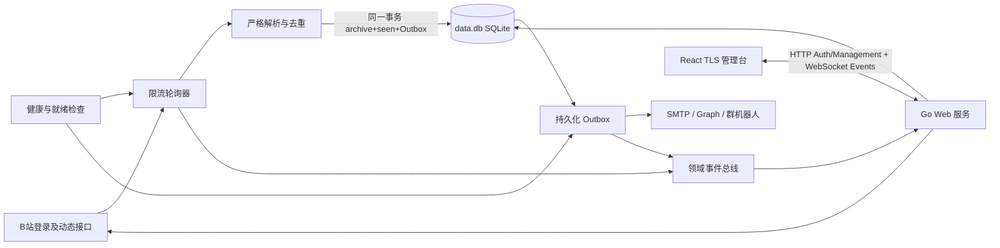

# Bili Notify 需求分析与技术设计

## 1. 背景与边界

Bili Notify 面向个人或小团队，在一个 Docker 容器中监控最多 100 个 B 站 UP 主。B 站没有面向任意 UP 主动态的官方推送能力，因此服务使用登录后的网页接口轮询；“及时”是接口可用和未触发风控时的服务目标，不是无条件保证。

系统处理登录账号有权查看的新动态（公开或充电专属，含文字、图片、视频投稿、专栏、转发、PGC 和通用内容卡片），并在启用时额外监控 UP 本人在其最近 N 条视频/动态/专栏评论区中的回复。直播状态、动态编辑、置顶变化、删除、关键词过滤、粉丝评论全量监听、UP 在他人内容下的发言、多租户、多实例高可用和**向 B 站主动历史回补**不在范围内。已采集内容会写入本地内容库供管理台查询。未知动态结构不会被猜测解析或标记为已处理；账号无权查看的充电动态会跳过且不标记为已处理；无法确定评论区坐标（type/oid）的内容不会进入评论跟踪。

主要目标：

- 最多 100 个 UP 时，动态发现延迟 P95 不超过 60 秒；健康渠道投递 P95 不超过 10 秒。
- 首次添加 UP 只建立当前页基线，不发送历史内容；新纳入评论跟踪的内容同样只 baseline 已有 UP 回复。基线内容仍会写入内容库，便于管理台回看。
- 每条新动态或新的 UP 回复广播给全部已启用渠道；容器重启不丢失待投递通知。
- UP 回复通知必须从根评论展开完整对话串；仅保证在「最近 N 条内容」与根/子评论翻页窗口内可发现。
- 部署前不生成或挂载任何主密钥、管理员密码哈希或 TLS 私钥。
- 管理台在桌面和手机上提供可访问、实时且明确区分在线与过期数据的运维视图；并支持对已采集动态/UP 回复的分页检索。

## 2. 系统结构

代码按功能划分为顶层包：`bilibili` 负责网页接口与二维码登录，`state` 负责事务和持久化（单一 SQLite `data.db`：配置/Outbox/内容档案，GORM + goose 版本化迁移），`notify` 负责投递协议，`service` 负责编排轮询、OAuth、Outbox 和领域事件，`web` 负责认证、管理 REST API、WebSocket 事件流与嵌入式管理台，`cmd` 只处理命令和非秘密启动配置。

轮询器默认以 30 秒为目标周期、全局 2 请求/秒、4 个并发请求。服务默认每 10 分钟批量查询当前登录账号与监控 UP 的关注关系：已关注且完成空间同步的 UP 使用账号综合动态流，其余 UP 轮询空间动态；关系未知时明确走空间接口。已关注 UP 默认每 30 分钟额外执行一次空间完整性校验。空间和综合流默认最多翻 10 页；超过上限不会静默推进游标，综合流会退回空间同步后重新建立基线。

评论监控使用独立较慢的批次周期（默认 120 秒），与动态轮询共用全局速率与并发预算。每个 UP 仅跟踪最近 N 条（默认 10）可映射评论区坐标的内容；每内容最多翻根评论 P 页（默认 2）、子评论 R 页（默认 5）。基础采集、高级采集、投递与积压告警、五段重试、日志级别及审计日志保留期组成一份版本化运行设置，空库首次从启动配置和代码默认值播种，之后由 SQLite 持久化并通过管理台完整热更新。版本不匹配的旧记录直接拒绝启动，不自动升级。

新动态按发布时间由旧到新处理。完整正文、动态/评论 `seen` 与对应启用渠道的投递任务在**同一 SQLite 事务**内提交（`INSERT OR IGNORE` 档案；含 baseline；系统告警 `uid=system` 不入库）。任务只有在平台 HTTP 状态和业务码均成功后才删除；网络错误、429 和 5xx 分级重试，不可恢复配置或鉴权错误进入阻塞状态。管理员可以将单个阻塞任务手动改回立即到期的待投递状态，实际发送仍由后台 Outbox 调度器异步执行；该操作保留尝试次数、最后错误与分段投递进度，避免部分成功的多段消息重复发送。删除 UP 会在同一事务内取消该 UP 尚未投递的动态与评论任务，并清除去重状态和内容库记录，避免删除后继续发送或留下失去所属资源的 Outbox。v1 内容库无自动淘汰，体积随监控时长增长。

## 3. B站与通知协议

B站适配器使用二维码生成、二维码轮询、导航验证、关注关系 `/x/relation/relations`、综合动态更新 `/x/polymer/web-dynamic/v1/feed/all/update`、综合动态 `/x/polymer/web-dynamic/v1/feed/all`、空间动态，以及评论根列表 `/x/v2/reply` 与子评论 `/x/v2/reply/reply`。动态请求显式携带登录 Cookie 与 `itemOpusStyle,listOnlyfans,onlyfansAssetsV2` 功能开关，以获取账号有权查看的充电动态。综合流只深度解析已关注的监控 UP；动态档案、seen、Outbox 与账号级 `update_baseline` 原子提交。登录成功后必须再次验证账号 UID 和名称才加密保存 Cookie；切换账号会重建关注关系和综合流基线，但保留内容档案与 per-UP 去重状态。不配置风控规避逻辑，不实现 WBI（若经典评论接口全面失效需另立项）。二维码状态由 Engine 每两秒推进并通过领域事件推送到管理台。

动态类型按实际内容归一化：B 站返回为 `DYNAMIC_TYPE_DRAW` 但图文卡片没有图片时记为 `DYNAMIC_TYPE_WORD`；有图片时仍为 `DRAW`。评论区坐标优先取动态 `basic.comment_type` 与 `basic.comment_id_str`，且始终以 B 站原始类型解释坐标；因此无图文字 opus 仍可能使用相簿评论区 11。缺失 `basic` 时仅对可确定映射的原始类型兜底（视频 avid、文字/转发动态 id、专栏 cvid）。图文动态在无 `basic` 时不得猜测 11/17，直接跳过跟踪。转发评论区挂在转发自身。PGC 与通用卡片不进入评论跟踪。

SMTP 只支持隐式 TLS 和 STARTTLS，并校验证书。Microsoft 使用 OAuth 2.0 设备码与委托 `Mail.Send` 权限，访问令牌过期时自动刷新并持久化。钉钉、飞书和企业微信使用 HTTPS Webhook，钉钉与飞书要求签名密钥。飞书渠道可额外配置成对的应用 `app_id` / `app_secret`，用于上传图片并在 `post` 中内嵌 `image_key`；未配置时图片仍以链接展示。

所有通知 HTTP 协议响应最多读取 1 MiB；成功响应超过上限、JSON 损坏、业务码缺失或类型漂移都视为永久协议错误，避免把无法证明成功的响应误判为已投递。网络故障、HTTP 429 和 5xx 可重试，`Retry-After`（秒数或 HTTP 日期）是重试调度的最小等待时间；4xx、OAuth 凭据失效和明确业务错误进入阻塞。错误只保留操作名、HTTP 状态和业务码，不拼接响应正文、请求 URL、OAuth 描述或飞书 `msg`，避免 Webhook 查询签名、令牌及上游回显秘密进入日志。

采集在写入档案与 Outbox 之前，按动态 `Media`（含封面与图文图片，以及一层转发原文）尽力下载 CDN 文件到 `data_dir/media/{uid}/{dynamic_id}/`，并把相对路径写回 `local_path`。单文件上限 10 MiB，只接受 HTTP(S)、公网目标和内容嗅探结果为图片的响应；每次重定向重新校验目标，避免媒体 URL 被用来访问回环、私网和链路本地服务。下载失败不阻断文字归档与投递，保留远程 URL。不做存量历史回填。读取、写入与删除均拒绝 `media/` 以下任一已有路径组件为符号链接，临时文件与最终文件分别使用 `0600` 和原子 rename；失败时删除临时文件。删除 UP 时同步删除其 media 子目录。v1 无自动淘汰，`media/` 与内容库一并随监控时长增长。

动态通知保存接口返回的完整正文，并按类型提取标题、简介、内容直达链接、富文本链接、封面或多图、视频时长与播放信息、互动统计和转发原文；动态正文本身不为补充内容发起额外的 B 站请求。升级后每个已有 UP 首次可见的充电动态只归档并建立 seen 基线，不投递；同批普通新动态照常投递，后续新充电动态正常投递。评论通知在发现 UP 回复后按 root 展开对话串。邮件与 Microsoft Graph 在存在本地文件时以内联 CID/附件嵌入图片，否则退回远程 ``；钉钉自定义机器人继续使用可展示外链图片的 Markdown（``，不用本地文件）；飞书在配置应用凭证且本地文件可用时上传并内嵌图片，否则列为链接；企业微信先发正文 Markdown，再按序追加 `msgtype=image`（原始字节 ≤2 MiB），并在 Outbox `progress` 中记录已成功段以便重试不重复。机器人消息在各平台限制内按 UTF-8 边界截断，始终保留截断提示和原内容链接。

## 4. 管理接口与实时协议

管理服务默认监听 `:8443`，只接受 TLS 1.3。静态 React 页面、认证接口和 WebSocket 同源部署。

HTTP 承担认证生命周期和全部管理资源 API：

| 方法与路径 | 用途 |
| --- | --- |
| `GET /api/v1/session` | 查询初始化和会话状态 |
| `POST /api/v1/setup` | 使用日志初始化码设置首个管理员密码 |
| `POST /api/v1/session` | 登录 |
| `DELETE /api/v1/session` | 注销 |
| `PUT /api/v1/session/password` | 验证当前密码并修改密码 |
| `GET /api/v1/dashboard` | 获取完整管理台快照 |
| `POST /api/v1/ups`、`PUT/DELETE /api/v1/ups/{uid}` | 创建、更新或删除 UP 主 |
| `POST /api/v1/channels`、`PUT/DELETE /api/v1/channels/{id}` | 创建、更新或删除通知渠道 |
| `POST /api/v1/channels/{id}/test` | 发送渠道测试通知 |
| `POST /api/v1/deliveries/{id}/retry` | 将单个阻塞投递任务立即重新入队，返回 202，不同步等待发送 |
| `POST/DELETE /api/v1/bilibili-login[/{id}]` | 启动或取消 B 站扫码登录 |
| `POST/DELETE /api/v1/channels/{id}/microsoft-login` | 启动或取消 Microsoft 授权 |
| `PUT /api/v1/settings` | 严格校验并完整更新 18 项运行设置 |
| `GET /api/v1/dynamics[/{id}]`、`GET /api/v1/comments[/{rpid}]` | 查询历史列表或内容详情 |
| `GET /api/v1/dynamics/{id}/media/{index}` | 读取已落盘的动态媒体（需会话） |
| `GET /api/v1/audit-logs` | 按操作、结果、资源、时间和关键字分页查询管理员操作日志 |
| `GET /api/v1/ws` | 校验会话并升级 WebSocket |

HTTP 负责全部浏览器主动请求：资源写操作使用单个、合法 UTF-8 的 JSON body，硬上限为 1 MiB，写请求必须携带会话中的 CSRF Token；`PUT /api/v1/settings` 必须提交全部字段，缺失和未知字段均拒绝。历史查询使用 `uid?`、`q?`、`from?`、`to?`（RFC3339）、`limit?`（默认 20，最大 100）和 `offset?`，时间范围为半开区间 `[from, to)`。动态历史列表的每个条目直接从已归档的 `payload_json` 投影正文、媒体 `media(kind/url/width/height)`、互动统计 `stats(forwards/comments/likes)`、视频元数据 `video(duration/views/danmaku)` 和一层 `original` 引用预览（含原内容的视频元数据），前端无需逐条请求内容详情；若条目已有本地文件，列表中的 `media.url` 改写为同源 `/api/v1/dynamics/{id}/media/{index}`，否则保留 CDN URL。旧归档没有统计或视频字段时省略对应字段；列表不返回评论坐标与磁盘路径。WebSocket 仅承载服务端事件 `event/revision/data`，不接受业务命令；连接后先发送完整 `snapshot`（含 `settings`），后续推送状态、运行设置、UP、渠道、投递、B站登录和 Microsoft 授权领域更新。重连后使用新快照修复断线期间遗漏的状态。

领域事件主要由实际状态写入驱动：空闲投递周期不发布事件，空闲采集不广播整份 UP 列表；关注关系刷新、采集路由改变、就绪状态或风控暂停等时间派生状态跨越边界时发布对应轻量事件。投递成功、失败、重试或阻塞只标记状态和投递主题；渠道授权信息只有在实际变化时才标记渠道主题。事件总线使用主题脏标记合并突发更新，业务路径不等待浏览器。每个连接只有一个串行写入器；慢客户端会被关闭并通过重连恢复。WebSocket 消息限制为 1 MiB，并以独立的 30 秒 Ping 保活。

管理员会话 Cookie 为 Secure、HttpOnly、SameSite=Strict，空闲 8 小时或创建 24 小时后失效。登录和初始化只按 TCP 对端来源地址（不信任客户端可伪造的代理转发头）与全局失败次数限流，窗口一分钟后恢复。WebSocket 必须通过会话 Cookie 和同源 Origin 校验；密码修改会清空所有会话并关闭全部连接。

所有管理 API 响应携带服务端生成的 `X-Request-ID`。认证和状态变更请求（含失败、未认证和 CSRF 拒绝）同步追加到 SQLite `audit_logs`，记录管理员/匿名来源、独立会话标识、远端地址、路由、目标、结果、耗时和白名单变更摘要；不记录普通读取、静态资源和 WebSocket 消息。操作日志默认保留 180 天，由管理台分页查询。审计写入失败不会篡改已经完成的业务结果，但会输出系统错误并增加指标。

渠道读模型只返回非秘密设置与 `configured_secrets`，不返回掩码占位值。渠道更新中省略秘密表示保留，显式提供表示替换；OAuth 令牌不接受浏览器写入。

## 5. 首次初始化与秘密保护

服务使用单一 `data_dir`，默认 `/data`。首次启动自动创建：

- `data.db`，SQLite（goose 版本化 schema），文件模式 `0600`；
- `master.key`，32 字节随机 AES-256 主密钥，模式 `0600`；
- `tls.pem`，ECDSA P-256 自签名证书和私钥，模式 `0600`；
- `media/`，动态图片/封面落盘目录，目录模式 `0700`，文件 `0600`（按需创建）。

目录模式为 `0700`。已有数据库缺少主密钥、密钥长度错误、TLS 文件损坏或迁移失败时拒绝启动，不自动覆盖或删除。若目录中仍存在旧版 `state.db` / `content.db`，拒绝启动且不自动导入；运维需备份后换用全新数据目录。主密钥与数据库同卷以无人值守重启为优先，因此不承诺防护整个数据卷同时失窃。

未初始化数据库启动时生成 12 位 Crockford Base32 初始化码，只写入结构化日志并保存在进程内存。首次设置管理员密码使用原子事务，成功后代码立即清除；未初始化实例重启会生成新码。管理员密码使用 Argon2id，哈希保存在数据库元数据中。

Cookie、B站 Cookie、SMTP 密码、OAuth 令牌、Webhook 与机器人签名密钥使用 AES-256-GCM 加密，每条记录使用独立 nonce，并把 **表名与主键** 作为附加认证数据。浏览器和日志不输出任何秘密。

本版本不迁移旧 bbolt/双库卷；旧卷由操作者显式备份和移除，程序不会执行破坏性升级。

## 6. 管理台设计

前端使用 React、TypeScript、Vite、MUI、React Router 和 Zod，构建产物通过 Go `embed` 打入单一二进制。`App` 只负责主题与会话，`Console` 负责实时连接、导航和快照协调，各管理页面及历史富内容组件按领域独立；日期格式化显式接收服务端时区，不使用跨组件可变全局状态。页面采用实时运维工作台而不是等权卡片墙：概览首先显示整体就绪状态和阻塞原因，再显示当前 B站账号 UID/名称、UP、渠道与队列证据，最后提供操作；UP 列表显示关注状态、检查时间和当前综合流/空间采集路由。设置页将 18 项运行参数分为基础采集、高级采集、投递与告警、日志四组，一次提交完整设置；外观主题和管理员密码保持独立。历史页按需查询 `data.db` 中的内容档案，支持动态/UP 回复 Tab、UP 过滤、时间范围、关键字与分页；筛选进入 URL。动态历史使用接近 B 站网页动态流的直接阅读布局：正文可原生选择复制，图文采用单图或九宫格，视频等内容采用封面信息卡，转发内容嵌套展示，底部显示已有互动统计和独立的原内容外链；动态条目本身不打开详情弹窗。

后端没有指标历史时间序列，因此界面不制造无依据图表。数据使用 KPI、状态标签、卡片和明细列表；成功、警告、失败状态同时使用颜色、图标和文字。主题支持跟随系统、浅色和深色，偏好只存 localStorage；路由和筛选进入 URL，秘密和会话不进入浏览器持久化存储。

桌面使用侧栏，360–430px 手机使用底部导航、卡片列表和全屏编辑对话框。每次点击侧栏或底部导航都主动重新读取 dashboard；再次点击当前页面时保留 URL 筛选条件，历史页还会按当前筛选重新查询内容列表。动态图片点击进入灯箱，组图支持按钮及键盘左右切换、Esc 或遮罩关闭，首尾不循环，灯箱始终使用未加缩略参数的原始媒体地址。投递队列只为阻塞任务提供逐条“立即重试”，提交后由后台异步发送。主要触控区域至少 44px，键盘焦点、屏幕阅读器标签和减少动画偏好必须可用。实时连接中断时保留最后成功数据、显示更新时间和过期警告，并按 1–30 秒指数退避重连。

时间统一使用进程本地时区（`time.Local` / 环境变量 `TZ`，镜像内嵌 `tzdata`）：通知文案中的发布时间、管理台展示、结构化日志时间字段均按本地墙钟输出；相对时刻比较仍基于绝对时间点，不依赖时区。Compose 默认 `TZ=Asia/Shanghai`。

## 7. 可观测性、运行与验证

Makefile 是本地与 CI 的统一任务入口：`make check` 执行全部前端与 Go 检查，`make -jN check` 按依赖图并行执行互不冲突的检查，`make build` 生成本地二进制，`make docker-build` 生成生产镜像，细分目标通过 `make help` 查看。CI 根据 runner 类型分别限制 Make、Go、Vitest 和 Playwright 的并发数，避免嵌套 worker 过度争抢 CPU 与内存。

私有观测服务默认监听 `:9090`：`/healthz` 表示进程存活，`/readyz` 要求有效 B站会话、启用的 UP 和渠道以及近期成功采集。应用通过 OTLP 导出 logs、metrics 和 traces，不再提供应用内 `/metrics`。Metrics 覆盖工作流、B 站请求、内容发现、投递、Outbox、媒体、认证/就绪/风控、UP/渠道/评论目标、关键配置阈值和审计失败；不使用 UID、渠道 ID、错误文本或正文作为属性。

运行日志使用 `log/slog` 输出统一 JSON stdout，并通过 OTel log bridge 导出；字段包含 schema、服务版本、进程 `run_id`、`category=system|audit`、组件、稳定事件名、结果和耗时。日志级别立即热更新，审计日志保留期由应用管理，系统日志保留期由 Loki 管理。密码、Cookie、Webhook、令牌及 URL 查询中的秘密均脱敏；`setup_code` 仅输出 stdout，OTLP 记录中脱敏。

可选观测栈由 OpenTelemetry Collector、Prometheus、Loki、Tempo 和 Grafana 组成。Collector 启用 memory limiter、batch、出口重试和 file-storage 持久化队列，logs 写 Loki，metrics 以 OpenMetrics 在 `:9464` 导出，traces 写 Tempo。Prometheus 还抓取 Collector、Loki、Tempo、Prometheus 和 Grafana 自身指标。Loki/Prometheus 保留 30 天，Tempo 保留 7 天；Grafana 预置数据源关联、运行总览、日志/trace 面板和 Prometheus 告警。基础部署显式禁用 SDK，完整栈使用 Cobra/Viper 管理的 `BILI_NOTIFY_OTEL_*` 配置启用。

Trace 用于关联管理 HTTP、采集/评论/关系/认证/投递/审计工作流、B 站逻辑外部操作和 GORM/SQLite。Outbox 创建任务时把当前采集 span 的 W3C `traceparent` 写入任务载荷，异步投递恢复它作为 `delivery.send` 的父上下文，使采集、SQLite 入队、投递和通知渠道调用出现在同一条 trace；同一内容的多渠道投递形成并列分支，重试继续使用最初的采集上下文。系统通知等没有有效来源上下文的任务归入当次投递调度 trace，非法上下文只降级、不影响投递。空闲投递轮询及其 SQLite 查询不产生 root span。对这个低流量服务使用 parent-based always-sample，不记录探针、静态资源和 WebSocket 长连接，只记录握手；外部请求 span 不记录完整 URL/查询，GORM span 不记录查询变量。运行时导出失败不停止业务，非法 SDK/协议配置在启动时拒绝。异步父 span 可以先于投递子 span 结束，因此重试会拉长整条 trace；若跨度超过 Tempo 保留期，只能看到保留窗口内的部分。

生产镜像使用 Node 24 构建前端、与 `go.mod` 同步的 Go 工具链静态构建后端，最终 scratch 镜像以 UID 65532 运行，只挂载独立 `/data` 卷并保持只读根文件系统。Renovate 只跟踪 Go 正式版，必须同时解析到新的 `go` 指令版本和可用的 Alpine 构建镜像后才创建单个升级 PR；PR 通过现有 CI 验证，不自动合并。

自动测试覆盖：

- 真实应用装配的首次设置播种、健康接口、取消后的优雅退出和同数据目录重启，并对旧数据库、损坏 TLS、无法解密的持久化秘密和非法遥测协议执行启动失败测试；审计保留以可单次执行的批处理验证精确时间边界、超过 1000 条时的分批删除、数据库失败和取消；
- 空间动态与综合流的多页正常路径、seen 前沿停止、空或重复 offset、接口计数不足以及页数上限；任何不完整动态分页都不得提交部分历史、seen 或 Outbox，综合流溢出会清空 feed 游标并要求空间流重新同步；评论根页或子回复达到扫描上限时，已发现通知必须标记 `incomplete`；
- 投递调度通过受控阻塞渠道验证初始及热更新后的并发上限，通过五段退避及饱和边界验证重试，并保留不依赖绝对耗时门限的消息构造 benchmark；
- 各动态类型的富内容解析、评论区坐标映射、UP 回复发现与根串展开、基线、去重、Outbox、渠道渲染、篇幅边界、重试与通知协议；
- 本地真实 SMTP 会话同时覆盖隐式 TLS、STARTTLS、证书验证、AUTH PLAIN、多收件人、multipart/alternative 与内联 CID，并注入认证、RCPT、DATA 断流和取消故障；Microsoft OAuth/Graph 与群机器人使用本地确定性 HTTP 合同覆盖刷新持久化、401/429/5xx、`Retry-After`、截断/超大/畸形响应、业务码 schema drift、取消和错误脱敏，飞书 token 缓存验证应用隔离、过期刷新与并发单飞；
- 自动主密钥/TLS 生成、权限、损坏文件和旧 schema 拒绝；
- Argon2id、一次性初始化、会话、限流、密码变更与连接失效；
- 真实认证与 CSRF HTTP 管理 API（含 B站/Microsoft 登录和渠道测试的成功、取消、重复、上游失败与超时）、WebSocket 全主题与 revision、空闲周期不推送、会话过期、恶意 Origin、注销/密码变更连接失效、断开客户端隔离、重连快照和秘密读模型；
- JSON 体积与 UTF-8 边界、安全响应头、登录限流窗口/来源隔离/伪造代理头、TLS 最低版本与私钥权限，以及媒体路径逃逸、父目录/文件符号链接、重定向、SSRF、非图片、取消和失败临时文件清理；
- 操作日志追加、筛选、保留清理、拒绝/失败路径、请求 ID和秘密值回归；
- React 单元、状态和组件测试覆盖 API、WebSocket、状态归约、异步请求竞态、历史坏行容错、结构化表单的全部字段连线、桌面/移动端以及明暗主题；四项全局覆盖率均以 80% 为门禁，设置页、控制台和操作日志页另设不低于当前薄弱面的文件级门禁，避免辅助函数掩盖关键页面回退；
- Chromium 确定性端到端链路把采集投递、管理安全和响应式验证拆为测试级隔离场景，每个场景使用独立临时目录、SQLite、随机端口和 Go harness，并同时运行桌面浅色与 Pixel 7 触控深色项目：覆盖管理员初始化、二维码登录、关注关系与空间基线、综合流采集、历史归档、失败 Outbox、同目录重启、人工重试、无刷新 WebSocket 重连、资源编辑、设置持久化、操作日志安全摘要、秘密不回显和密码变更后的全会话失效；使用 axe 扫描登录、概览、操作日志和移动历史页面，并提交移动历史视觉基线；测试只连接本地 TLS 伪上游；
- `web/testdata/contracts/` 中提交 REST 与 WebSocket JSON 契约样例；Go 侧以真实 HTTP 处理器和生产 WebSocket 序列化类型校验，Vitest 读取同一文件并以集中式 Zod schema 解析，TypeScript API 类型由 schema 推导；
- 生产 scratch 镜像的 nonroot/只读运行、健康检查、HTTPS 初始化、优雅停止和同卷重启。
- `telemetry.New` 通过本地 OTLP/HTTP protobuf 与 OTLP/gRPC 收集端真实导出 traces、metrics、logs，校验三类带前缀路径、资源属性、span/metric/log 字段和 Shutdown flush；不可达收集端验证记录路径不等待网络，导出失败仅在有界 Shutdown 返回。Prometheus 告警规则使用 `promtool test rules` 验证触发语义，Compose、Collector、Prometheus、Loki 与 Tempo 配置由独立 CI job 验证，不把 Docker 依赖加入普通单元测试。

提交前执行前端类型检查、`npm run test:coverage` 和 `npm run test:e2e`，以及 `go build ./...`、`go test ./...`、`go test -race -shuffle=on ./...` 和 `go vet ./...`；完整本地门禁可通过 `make check` 运行，多核机器可使用 `make -jN check`。`web/dist` 是不纳入 Git 的构建产物；Make 在一次完整检查中只从 lockfile 安装并构建一次前端，所有会编译 `web` 包的 Go 目标和 Playwright 均依赖该产物。Vitest 使用 V8 统计除入口、纯类型和测试辅助代码之外的前端生产代码，statements、branches、functions、lines 任一低于 80% 时 CI 失败，并对关键页面执行额外文件级阈值。Playwright 使用锁定版本的 Chromium 分别模拟桌面浅色和触控手机深色；axe 严重违规或已提交视觉基线变化均使检查失败。Go 覆盖率门禁只统计 `bilibili`、`notify`、`service`、`state`、`web` 五个核心包；CI 以 `go test -race -covermode=atomic -coverpkg="$(go list ./bilibili ./notify ./service ./state ./web | paste -sd, -)" -coverprofile=coverage.out ./...` 一次运行仓库全部测试并同时完成 race 与覆盖率验证，总覆盖率低于 80% 时失败。常规 CI 通过 `make test-race` 随机化 Go 测试顺序，独立的每日/手动 Stability workflow 通过 `make test-stability` 在 race detector 下默认重复全部测试 10 次；重复次数由 `GO_STABILITY_COUNT` 覆盖，重型门禁不加入普通本地 `make check`。Go 覆盖率报告通过 GitHub OIDC 上传 Codecov，不配置静态 Token，项目与 patch 目标均固定为 80%。`make test-protocol` 在 race detector 下重复通知与遥测协议测试三次，`make benchmark` 提供通知序列化、投递消息和禁用遥测记录的无绝对耗时阈值 benchmark。CI 必须在 Go 检查前构建前端，对观测配置与告警规则运行独立门禁，并对最终 Docker 镜像运行冒烟测试。Docker 构建必须从 lockfile 重建前端并生成完整单二进制镜像；基础及完整 Compose 中应用保持镜像 UID 65532、只读根文件系统、无额外 capability，并使用命名卷实现重启持久化。
