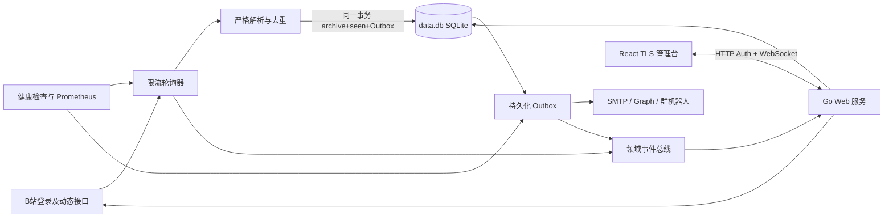

# Bili Notify 需求分析与技术设计

## 1. 背景与边界

Bili Notify 面向个人或小团队，在一个 Docker 容器中监控最多 100 个公开 B 站 UP 主。B 站没有面向任意 UP 主动态的官方推送能力，因此服务使用登录后的网页接口轮询；“及时”是接口可用和未触发风控时的服务目标，不是无条件保证。

系统处理新发布的公开动态（文字、图片、视频投稿、专栏、转发、PGC 和通用内容卡片），并在启用时额外监控 UP 本人在其最近 N 条视频/动态/专栏评论区中的回复。直播状态、动态编辑、置顶变化、删除、关键词过滤、粉丝评论全量监听、UP 在他人内容下的发言、多租户、多实例高可用和**向 B 站主动历史回补**不在范围内。已采集内容会写入本地内容库供管理台查询。未知动态结构不会被猜测解析或标记为已处理；无法确定评论区坐标（type/oid）的内容不会进入评论跟踪。

主要目标：

- 最多 100 个 UP 时，动态发现延迟 P95 不超过 60 秒；健康渠道投递 P95 不超过 10 秒。
- 首次添加 UP 只建立当前页基线，不发送历史内容；新纳入评论跟踪的内容同样只 baseline 已有 UP 回复。基线内容仍会写入内容库，便于管理台回看。
- 每条新动态或新的 UP 回复广播给全部已启用渠道；容器重启不丢失待投递通知。
- UP 回复通知必须从根评论展开完整对话串；仅保证在「最近 N 条内容」与根/子评论翻页窗口内可发现。
- 部署前不生成或挂载任何主密钥、管理员密码哈希或 TLS 私钥。
- 管理台在桌面和手机上提供可访问、实时且明确区分在线与过期数据的运维视图；并支持对已采集动态/UP 回复的分页检索。

## 2. 系统结构

代码按功能划分为顶层包：`bilibili` 负责网页接口与二维码登录，`state` 负责事务和持久化（单一 SQLite `data.db`：配置/Outbox/内容档案，GORM + goose 版本化迁移），`notify` 负责投递协议，`service` 负责编排轮询、OAuth、Outbox 和领域事件，`web` 负责认证、WebSocket 与嵌入式管理台，`cmd` 只处理命令和非秘密启动配置。

轮询器默认以 30 秒为目标周期、全局 2 请求/秒、4 个并发请求；这三项作为空库首次默认值写入 SQLite，之后可在管理台热更新并立即生效。每个 UP 最多翻 10 页直至遇到已持久化动态；超过上限会停止该 UP 的提交，避免静默丢失。

评论监控使用独立较慢的批次周期（默认 120 秒），与动态轮询共用全局速率与并发预算。每个 UP 仅跟踪最近 N 条（默认 10）可映射评论区坐标的内容；每内容最多翻根评论 P 页（默认 2）、子评论 R 页（默认 5）。`comment_enabled`、`comment_track_n`、`comment_root_pages`、`comment_reply_pages`、`comment_batch_interval_sec` 与动态三项一并热更新。

新动态按发布时间由旧到新处理。完整正文、动态/评论 `seen` 与对应启用渠道的投递任务在**同一 SQLite 事务**内提交（`INSERT OR IGNORE` 档案；含 baseline；系统告警 `uid=system` 不入库）。任务只有在平台 HTTP 状态和业务码均成功后才删除；网络错误、429 和 5xx 分级重试，不可恢复配置或鉴权错误进入阻塞状态。删除 UP 会同时清除去重状态与该 UP 的内容库记录。v1 内容库无自动淘汰，体积随监控时长增长。

## 3. B站与通知协议

B站适配器使用二维码生成、二维码轮询、导航验证、空间动态，以及评论根列表 `/x/v2/reply` 与子评论 `/x/v2/reply/reply`；不配置备用来源或风控规避逻辑，不实现 WBI（若经典评论接口全面失效需另立项）。二维码状态由 Engine 每两秒推进并通过领域事件推送到管理台；登录成功后必须再次验证会话才加密保存 Cookie。

评论区坐标优先取动态 `basic.comment_type` 与 `basic.comment_id_str`；缺失时仅对可确定映射的类型兜底（视频 avid、文字/转发动态 id、专栏 cvid）。图文动态在无 `basic` 时不得猜测 11/17，直接跳过跟踪。转发评论区挂在转发自身。PGC 与通用卡片不进入评论跟踪。

SMTP 只支持隐式 TLS 和 STARTTLS，并校验证书。Microsoft 使用 OAuth 2.0 设备码与委托 `Mail.Send` 权限，访问令牌过期时自动刷新并持久化。钉钉、飞书和企业微信使用 HTTPS Webhook，钉钉与飞书要求签名密钥。

动态通知保存接口返回的完整正文，并按类型提取标题、简介、内容直达链接、富文本链接、封面或多图、视频时长与播放信息、互动统计和转发原文；动态正文本身不为补充内容发起额外的 B 站请求。评论通知在发现 UP 回复后按 root 展开对话串；邮件和 Microsoft Graph 使用完整 HTML 与纯文本备选，钉钉使用可展示外链图片的 Markdown，飞书使用 `post` 富文本并把图片列为链接，企业微信使用正文优先的单条 Markdown 并把图片列为链接。机器人消息在各平台限制内按 UTF-8 边界截断，始终保留截断提示和原内容链接，不通过拆分消息引入部分成功与重复投递。

## 4. 管理接口与实时协议

管理服务默认监听 `:8443`，只接受 TLS 1.3。静态 React 页面、认证接口和 WebSocket 同源部署。

HTTP 只承担认证生命周期：

| 方法与路径 | 用途 |
| --- | --- |
| `GET /api/v1/session` | 查询初始化和会话状态 |
| `POST /api/v1/setup` | 使用日志初始化码设置首个管理员密码 |
| `POST /api/v1/session` | 登录 |
| `DELETE /api/v1/session` | 注销 |
| `PUT /api/v1/session/password` | 验证当前密码并修改密码 |
| `GET /api/v1/ws` | 校验会话并升级 WebSocket |

WebSocket 请求为 `id/action/payload`，响应使用相同 `id` 和 `ok/data/error`。服务端事件包含 `event/revision/data`；连接后先发送完整 `snapshot`（含 `settings`），后续推送状态、采集参数、UP、渠道、投递、B站登录和 Microsoft 授权领域更新。写操作包含 `settings.update`，payload 为完整采集参数：动态三项 `poll_interval_sec`、`request_rate`、`request_concurrency`，以及评论五项 `comment_enabled`、`comment_track_n`、`comment_root_pages`、`comment_reply_pages`、`comment_batch_interval_sec`。历史查询为按需命令（不进入 snapshot）：`dynamics.query` / `comments.query`（payload：`uid?`、`q?`、`from?`、`to?` RFC3339、`limit?` 默认 20 最大 100、`offset?`；时间范围为半开区间 `[from, to)`；返回 `items/total/limit/offset`），以及 `dynamics.get` / `comments.get` 取完整 payload。断线客户端不重放未知结果的写操作，重连后使用快照修复状态。

领域事件总线使用主题脏标记合并突发更新，业务路径不等待浏览器。每个连接只有一个串行写入器；慢客户端会被关闭并通过重连恢复。所有消息限制为 1 MiB，命令和写入均有超时。

管理员会话 Cookie 为 Secure、HttpOnly、SameSite=Strict，空闲 8 小时或创建 24 小时后失效。登录和初始化按来源地址与全局失败次数限流。WebSocket 必须通过会话 Cookie 和同源 Origin 校验；密码修改会清空所有会话并关闭全部连接。

渠道读模型只返回非秘密设置与 `configured_secrets`，不返回掩码占位值。渠道更新中省略秘密表示保留，显式提供表示替换；OAuth 令牌不接受浏览器写入。

## 5. 首次初始化与秘密保护

服务使用单一 `data_dir`，默认 `/data`。首次启动自动创建：

- `data.db`，SQLite（goose 版本化 schema），文件模式 `0600`；
- `master.key`，32 字节随机 AES-256 主密钥，模式 `0600`；
- `tls.pem`，ECDSA P-256 自签名证书和私钥，模式 `0600`。

目录模式为 `0700`。已有数据库缺少主密钥、密钥长度错误、TLS 文件损坏或迁移失败时拒绝启动，不自动覆盖或删除。若目录中仍存在旧版 `state.db` / `content.db`，拒绝启动且不自动导入；运维需备份后换用全新数据目录。主密钥与数据库同卷以无人值守重启为优先，因此不承诺防护整个数据卷同时失窃。

未初始化数据库启动时生成 12 位 Crockford Base32 初始化码，只写入结构化日志并保存在进程内存。首次设置管理员密码使用原子事务，成功后代码立即清除；未初始化实例重启会生成新码。管理员密码使用 Argon2id，哈希保存在数据库元数据中。

Cookie、B站 Cookie、SMTP 密码、OAuth 令牌、Webhook 与机器人签名密钥使用 AES-256-GCM 加密，每条记录使用独立 nonce，并把 **表名与主键** 作为附加认证数据。浏览器和日志不输出任何秘密。

本版本不迁移旧 bbolt/双库卷；旧卷由操作者显式备份和移除，程序不会执行破坏性升级。

## 6. 管理台设计

前端使用 React、TypeScript、Vite、MUI、React Router 和 Zod，构建产物提交并通过 Go `embed` 打入单一二进制。页面采用实时运维工作台而不是等权卡片墙：概览首先显示整体就绪状态和阻塞原因，再显示 B站会话、UP、渠道与队列证据，最后提供操作。设置页可修改采集参数（动态轮询间隔、请求速率、并发，以及评论监控开关、跟踪条数、根/子评论页数、评论批次间隔），以及外观主题和管理员密码。历史页按需查询 `data.db` 中的内容档案，支持动态/UP 回复 Tab、UP 过滤、时间范围、关键字与分页；筛选进入 URL。

后端没有指标历史时间序列，因此界面不制造无依据图表。数据使用 KPI、状态标签、卡片和明细列表；成功、警告、失败状态同时使用颜色、图标和文字。主题支持跟随系统、浅色和深色，偏好只存 localStorage；路由和筛选进入 URL，秘密和会话不进入浏览器持久化存储。

桌面使用侧栏，360–430px 手机使用底部导航、卡片列表和全屏编辑对话框。主要触控区域至少 44px，键盘焦点、屏幕阅读器标签和减少动画偏好必须可用。实时连接中断时保留最后成功数据、显示更新时间和过期警告，并按 1–30 秒指数退避重连。

时间统一使用进程本地时区（`time.Local` / 环境变量 `TZ`，镜像内嵌 `tzdata`）：通知文案中的发布时间、管理台展示、结构化日志时间字段均按本地墙钟输出；相对时刻比较仍基于绝对时间点，不依赖时区。Compose 默认 `TZ=Asia/Shanghai`。

## 7. 可观测性、运行与验证

私有观测服务默认监听 `:9090`：`/healthz` 表示进程存活，`/readyz` 要求有效 B站会话、启用的 UP 和渠道以及近期成功采集，`/metrics` 暴露轮询、发现延迟、投递结果和 Outbox 指标。指标不使用 UID、渠道 ID 或正文作为标签，日志不输出任何秘密。

生产镜像使用 Node 24 构建前端、Go 1.26.5 静态构建后端，最终 scratch 镜像以 UID 65532 运行，只挂载独立 `/data` 卷并保持只读根文件系统。

自动测试覆盖：

- 各动态类型的富内容解析、评论区坐标映射、UP 回复发现与根串展开、基线、去重、Outbox、渠道渲染、篇幅边界、重试与通知协议；
- 自动主密钥/TLS 生成、权限、损坏文件和旧 schema 拒绝；
- Argon2id、一次性初始化、会话、限流、密码变更与连接失效；
- WebSocket 协议、领域事件合并、重连快照和秘密读模型；
- React 状态归约、结构化表单、桌面/移动端以及明暗主题。

提交前执行前端类型检查、单元测试和构建，以及 `go build ./...`、`go test ./...`、`go test -race ./...` 和 `go vet ./...`。Docker 构建必须从 lockfile 重建前端并生成完整单二进制镜像。
