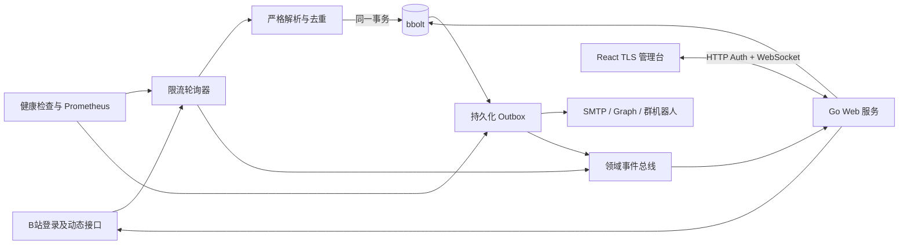

# Bili Notify 需求分析与技术设计

## 1. 背景与边界

Bili Notify 面向个人或小团队，在一个 Docker 容器中监控最多 100 个公开 B 站 UP 主。B 站没有面向任意 UP 主动态的官方推送能力，因此服务使用登录后的网页接口轮询；“及时”是接口可用和未触发风控时的服务目标，不是无条件保证。

系统只处理新发布的公开动态，包括文字、图片、视频投稿、专栏、转发、PGC 和通用内容卡片。直播状态、动态编辑、置顶变化、删除、关键词过滤、多租户、多实例高可用和历史回补不在范围内。未知动态结构不会被猜测解析或标记为已处理。

主要目标：

- 最多 100 个 UP 时，动态发现延迟 P95 不超过 60 秒；健康渠道投递 P95 不超过 10 秒。
- 首次添加 UP 只建立当前页基线，不发送历史内容。
- 每条新动态广播给全部已启用渠道；容器重启不丢失待投递通知。
- 部署前不生成或挂载任何主密钥、管理员密码哈希或 TLS 私钥。
- 管理台在桌面和手机上提供可访问、实时且明确区分在线与过期数据的运维视图。

## 2. 系统结构

代码按功能划分为顶层包：`bilibili` 负责网页接口与二维码登录，`state` 负责事务和持久化，`notify` 负责投递协议，`service` 负责编排轮询、OAuth、Outbox 和领域事件，`web` 负责认证、WebSocket 与嵌入式管理台，`cmd` 只处理命令和非秘密启动配置。

轮询器以 30 秒为目标周期，全局默认限制为 2 请求/秒、4 个并发请求。每个 UP 最多翻 10 页直至遇到已持久化动态；超过上限会停止该 UP 的提交，避免静默丢失。

新动态按发布时间由旧到新处理。`seen` 与所有启用渠道的投递任务在同一 bbolt 写事务内提交。任务只有在平台 HTTP 状态和业务码均成功后才删除；网络错误、429 和 5xx 分级重试，不可恢复配置或鉴权错误进入阻塞状态。

## 3. B站与通知协议

B站适配器只使用二维码生成、二维码轮询、导航验证和空间动态四个网页接口，不配置备用来源或风控规避逻辑。二维码状态由 Engine 每两秒推进并通过领域事件推送到管理台；登录成功后必须再次验证会话才加密保存 Cookie。

SMTP 只支持隐式 TLS 和 STARTTLS，并校验证书。Microsoft 使用 OAuth 2.0 设备码与委托 `Mail.Send` 权限，访问令牌过期时自动刷新并持久化。钉钉、飞书和企业微信使用 HTTPS Webhook，钉钉与飞书要求签名密钥。

动态通知保存接口返回的完整正文，并按类型提取标题、简介、内容直达链接、富文本链接、封面或多图、视频时长与播放信息、互动统计和转发原文；不为补充通知内容发起额外的 B 站请求。邮件和 Microsoft Graph 使用完整 HTML 与纯文本备选，钉钉使用可展示外链图片的 Markdown，飞书使用 `post` 富文本并把图片列为链接，企业微信使用正文优先的单条 Markdown 并把图片列为链接。机器人消息在各平台限制内按 UTF-8 边界截断，始终保留截断提示和原动态链接，不通过拆分消息引入部分成功与重复投递。

## 4. 管理接口与实时协议

管理服务默认监听 `:8443`，只接受 TLS 1.3。静态 React 页面、认证接口和 WebSocket 同源部署。

HTTP 只承担认证生命周期：

| 方法与路径 | 用途 |
| --- | --- |
| `GET /api/v1/session` | 查询初始化和会话状态 |
| `POST /api/v1/setup` | 使用日志初始化码设置首个管理员密码 |
| `POST /api/v1/session` | 登录 |
| `DELETE /api/v1/session` | 注销 |
| `PUT /api/v1/session/password` | 验证当前密码并修改密码 |
| `GET /api/v1/ws` | 校验会话并升级 WebSocket |

WebSocket 请求为 `id/action/payload`，响应使用相同 `id` 和 `ok/data/error`。服务端事件包含 `event/revision/data`；连接后先发送完整 `snapshot`，后续推送状态、UP、渠道、投递、B站登录和 Microsoft 授权领域更新。断线客户端不重放未知结果的写操作，重连后使用快照修复状态。

领域事件总线使用主题脏标记合并突发更新，业务路径不等待浏览器。每个连接只有一个串行写入器；慢客户端会被关闭并通过重连恢复。所有消息限制为 1 MiB，命令和写入均有超时。

管理员会话 Cookie 为 Secure、HttpOnly、SameSite=Strict，空闲 8 小时或创建 24 小时后失效。登录和初始化按来源地址与全局失败次数限流。WebSocket 必须通过会话 Cookie 和同源 Origin 校验；密码修改会清空所有会话并关闭全部连接。

渠道读模型只返回非秘密设置与 `configured_secrets`，不返回掩码占位值。渠道更新中省略秘密表示保留，显式提供表示替换；OAuth 令牌不接受浏览器写入。

## 5. 首次初始化与秘密保护

服务使用单一 `data_dir`，默认 `/data`。首次启动自动创建：

- `state.db`，bbolt schema 2，文件模式 `0600`；
- `master.key`，32 字节随机 AES-256 主密钥，模式 `0600`；
- `tls.pem`，ECDSA P-256 自签名证书和私钥，模式 `0600`。

目录模式为 `0700`。已有数据库缺少主密钥、密钥长度错误、TLS 文件损坏或 schema 不受支持时拒绝启动，不自动覆盖或删除。主密钥与数据库同卷以无人值守重启为优先，因此不承诺防护整个数据卷同时失窃。

未初始化数据库启动时生成 12 位 Crockford Base32 初始化码，只写入结构化日志并保存在进程内存。首次设置管理员密码使用原子事务，成功后代码立即清除；未初始化实例重启会生成新码。管理员密码使用 Argon2id，哈希保存在数据库元数据中。

Cookie、B站 Cookie、SMTP 密码、OAuth 令牌、Webhook 与机器人签名密钥使用 AES-256-GCM 加密，每条记录使用独立 nonce，并把 bucket 和 key 作为附加认证数据。浏览器和日志不输出任何秘密。

本 schema 不迁移外置主密钥版本；旧卷由操作者显式备份和移除，程序不会执行破坏性升级。

## 6. 管理台设计

前端使用 React、TypeScript、Vite、MUI、React Router 和 Zod，构建产物提交并通过 Go `embed` 打入单一二进制。页面采用实时运维工作台而不是等权卡片墙：概览首先显示整体就绪状态和阻塞原因，再显示 B站会话、UP、渠道与队列证据，最后提供操作。

后端没有历史时间序列，因此界面不制造无依据图表。数据使用 KPI、状态标签、卡片和明细列表；成功、警告、失败状态同时使用颜色、图标和文字。主题支持跟随系统、浅色和深色，偏好只存 localStorage；路由和筛选进入 URL，秘密和会话不进入浏览器持久化存储。

桌面使用侧栏，360–430px 手机使用底部导航、卡片列表和全屏编辑对话框。主要触控区域至少 44px，键盘焦点、屏幕阅读器标签和减少动画偏好必须可用。实时连接中断时保留最后成功数据、显示更新时间和过期警告，并按 1–30 秒指数退避重连。

## 7. 可观测性、运行与验证

私有观测服务默认监听 `:9090`：`/healthz` 表示进程存活，`/readyz` 要求有效 B站会话、启用的 UP 和渠道以及近期成功采集，`/metrics` 暴露轮询、发现延迟、投递结果和 Outbox 指标。指标不使用 UID、渠道 ID 或正文作为标签，日志不输出任何秘密。

生产镜像使用 Node 24 构建前端、Go 1.26.5 静态构建后端，最终 scratch 镜像以 UID 65532 运行，只挂载独立 `/data` 卷并保持只读根文件系统。

自动测试覆盖：

- 各动态类型的富内容解析、基线、去重、Outbox、渠道渲染、篇幅边界、重试与通知协议；
- 自动主密钥/TLS 生成、权限、损坏文件和旧 schema 拒绝；
- Argon2id、一次性初始化、会话、限流、密码变更与连接失效；
- WebSocket 协议、领域事件合并、重连快照和秘密读模型；
- React 状态归约、结构化表单、桌面/移动端以及明暗主题。

提交前执行前端类型检查、单元测试和构建，以及 `go build ./...`、`go test ./...`、`go test -race ./...` 和 `go vet ./...`。Docker 构建必须从 lockfile 重建前端并生成完整单二进制镜像。
